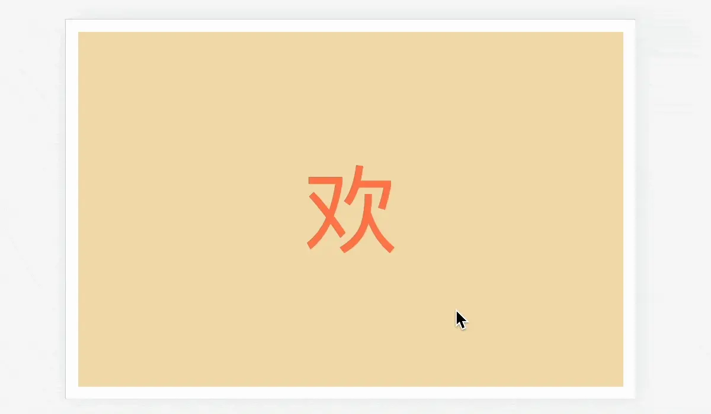

> This article is published on my personal website, original link: [A CSS-Only Scroll-Driven Animation Effect](https://blog.zhoujump.club/p/animation-timeline/)
## First, let's look at this simple example
### Code:
You can also scroll down to see the effect directly.
```html
<div class="out-cont">
    <!-- The outermost element, used to define the fixed distance of the element -->
    <div class="inner-cont">
        <!-- Inner element, used to fix the position of the element -->
        <div class="animation-item">
            <!-- The content of the element that plays the animation -->
        </div>
    </div>
</div>
<style>
.out-cont {
/* The outermost element, used to define the fixed distance of the element, which means the element will be fixed for two screen heights */
    width: 100%;
    height: 200vh;
    position: relative;
}
.inner-cont {
/* Inner element, used to fix the position of the element, using sticky to fix the element within the range */
    width: 100%;
    height: 50vh;
    position: sticky;
    top: 25vh;
    display: flex;
    align-items: center;
    justify-content: center;
}
.animation-item{
/* The content of the element that plays the animation, using animation-timeline to achieve scroll-driven animation */
    width: 20%;
    aspect-ratio: 1;
    background-color: #2E74B5;
    animation: move 1s linear forwards;
    animation-timeline: view();
    animation-range: contain;
}
@keyframes move {
    0% {
        transform: rotate(0deg);
        border-radius: 8%;
    }
    50% {
        transform: rotate(360deg);
        border-radius: 50%;
    }
    100% {
        border-radius: 8%;
        transform: rotate(720deg);
    }
}
</style>
```
### Effect:
<div class="out-cont">
    <div class="inner-cont">
        <div class="animation-item"></div>
        <div class="animation-view">
            <div class="animation-view-out">
                .out-cont
                <div class="animation-view-inner">
                    .inner-cont
                </div>
            </div>
            <div class="animation-view-screen">
                Viewport
            </div>
        </div>
    </div>
</div>

## sticky: Sticky Layout
For front-end developers, this is not unfamiliar, so I'll just briefly introduce it:
position: sticky is a layout method between position:relative and position:fixed. When the parent element appears on the screen, it behaves like fixed, fixing itself on the screen. When the parent element goes out of the screen, it behaves like relative, following the normal document flow layout, being taken away by the parent container.
Regarding how this case uses sticky to achieve similar element fixing effects, there is a simple demonstration on the right side of the effect example above, which can help with understanding. And this demonstration is also pure CSS.
> All parent elements of a sticky element cannot set overflow:hidden, as this will invalidate sticky. If really needed, you can use overflow:clip instead.

## animation-timeline: Scroll-Driven Animation
This is the core of this case. When this property is used on an element, the CSS animation defined by @keyframes will not play automatically, but will scroll according to the progress of the scrollbar.
This property has two main values:
- animation-timeline: view()
The animation starts when the element enters the viewport and ends when it leaves the viewport.
- animation-timeline: scroll()
The animation plays when the element scrolls within the entire scroll container.
- animation-timeline: cont-name
Named container, which will be discussed later.

<div class="animation-view-2">
    <div class="animation-view-2-item">
        <div class="animation-view-2-screen">
            Viewport
        </div>
        <div class="animation-view-2-anima anima-1">
            view()
        </div>
    </div>
    <div class="animation-view-2-item">
        <div class="animation-view-2-screen">
            Viewport
        </div>
        <div class="animation-view-2-anima anima-2">
            scroll()
        </div>
    </div>
</div>

### animation-timeline: scroll()
scroll() is for the entire page and is relatively simple. It is used for effects related to global scrolling, such as article reading progress. Here I quote a picture from [前端侦探](https://segmentfault.com/blog/xboxyan).
<!--  -->
scroll() can take two parameters: scroller and axis
- scroller
The scroller parameter is used to specify the scroll container, with the default value being `nearest`.
If set to `nearest`, the nearest ancestor scroll container will be used.
If set to `root`, the document viewport will be used as the scroll container.
If set to `self`, the element itself will be used as the scroll container.

- axis
The axis parameter is used to specify the scroll axis, with the default value being `block`.
If set to `block`, the block-level axis direction of the scroll container.
If set to `inline`, the inline axis direction of the scroll container.
If set to `x`, the element will scroll horizontally.
If set to `y`, the element will scroll vertically.

### animation-range
If I don't want the animation to play throughout the entire scrolling period, I can use the `animation-range` property to set the start and end positions of the animation, with `px` and `%` units both acceptable.
For example:
``` css
.animation{
    animation-range: 0 100px;
}
```
This way, the animation will only play when the scroll container scrolls to the position of 0 to 100px, and will not play after 100px.

### animation-timeline: view()
view() is relative to the position of the element and the viewport, and this case is based on view().
view() can also take two parameters: axis and inset
- axis
The axis parameter is used to specify the scroll axis, with the default value being `block`.
If set to `block`, the block-level axis direction of the scroll container.
If set to `inline`, the inline axis direction of the scroll container.
If set to `x`, the element will scroll horizontally.
If set to `y`, the element will scroll vertically.

- inset
The inset parameter is used to specify when the animation starts and ends, whether it starts when the element just peeks out or when the element completely enters the viewport, which is controlled by this property, somewhat similar to the role of `animation-range` above.
inset accepts one or two values. When there are two values, they represent the start position and end position, with `px` and `%` units both acceptable.

### animation-timeline: cont-name
You may have noticed that with the above properties alone, we can only achieve animations where the parent element scrolls to drive the child element. What if I need to scroll one container to drive the animation of another sibling element? Then we need to rely on named containers.
It's very simple to use. Just use an attribute `scroll-timeline-name` on the scroll container.
``` css
.scroll{
    /* Naming the scroll container */
    scroll-timeline-name: --my-scroller;
}
.animation{
    /* The element that needs to be driven by the animation */
    animation-timeline: --my-scroller;
}
```
In this way, when the `.scroll` container is scrolled, the `.animation` element will play the animation according to the scroll progress of the scroll container.

## Related Knowledge
[position:fixed](https://developer.mozilla.org/en-US/docs/Web/CSS/position#fixed)
[animation-timeline](https://developer.mozilla.org/en-US/docs/Web/CSS/animation-timeline)
[animation-range](https://developer.mozilla.org/en-US/docs/Web/CSS/animation-range)
[前端侦探](https://segmentfault.com/blog/xboxyan)
<style>
.animation-view-2 {
    font-size: 12px;
    width: 100%;
    display: flex;
    align-items: center;
    justify-content: center;
    height: 320px;
    position: relative;
    gap: 20px;
}
.animation-view-2-anima{
    width: 50px;
    height: 50px;
    color: white;
    text-align: center;
    line-height: 50px;
    background-color: #2E74B5;
}
.animation-view-2-screen{
    position: absolute;
    top: 0;
    left: 0;
    width: 100%;
    height: 80px;
    outline: 2px solid #2E74B5;
    animation: screen-2 2s linear infinite alternate;
}
.anima-1{
    animation: anima-1 2s linear infinite alternate;
}
.anima-2{
    animation: anima-2 2s linear infinite alternate;
}
@keyframes anima-2 {
    0% {
        transform: rotate(0deg);
        border-radius: 0%;
    }
    100% {
        transform: rotate(180deg);
        border-radius: 20%;
    }
}
@keyframes anima-1 {
    0% {
        transform: rotate(0deg);
        border-radius: 0%;
    }
    20% {
        transform: rotate(0deg);
        border-radius: 0%;
    }
    80% {
        border-radius: 20%;
        transform: rotate(180deg);
    }
    100% {
        transform: rotate(180deg);
        border-radius: 20%;
    }
}
@keyframes screen-2 {
    0% {
        top: 0
    }
    100% {
        top: 240px;
    }
}
.animation-view-2-item {
    display: flex;
    align-items: center;
    justify-content: center;
    position: relative;
    width: 100px;
    height: 320px;
    background-color: rgba(0, 0, 0, 0.1);
}
.article-page .main-article{
    overflow: clip;
}
.out-cont {
    width: 100%;
    height: 200vh;
    position: relative;
}
.inner-cont {
    width: 100%;
    height: 50vh;
    position: sticky;
    top: 25vh;
    display: flex;
    align-items: center;
    justify-content: center;
}
.animation-view{
    font-size: 12px;
    position: absolute;
    top: 0;
    right: 0;
    width: 100px;
    height: 320px;
    background-color: rgba(0, 0, 0, 0.1);
}
.animation-view-out{
    position: relative;
    margin-top: 80px;
    width: 100%;
    height: 160px;
    background-color: rgba(0, 0, 0, 0.1);
}
.animation-view-inner{
    width: calc(100% - 4px);
    height: 72px;
    position: absolute;
    top: 2px;
    left: 2px;
    border: 2px solid #2E74B5;
    animation: inner 1s linear both;
    animation-timeline: view();
    animation-range: contain;
    background-color: rgba(0, 0, 0, 0.1);
}
@keyframes inner {
    32% {
        top: 2px
    }
    66% {
        top: 82px;
    }
    100%{
        top: 82px;
    }
}
.animation-view-screen{
    position: absolute;
    top: 0;
    left: 0;
    width: 100%;
    height: 80px;
    outline: 2px solid #2E74B5;
    animation: screen 1s linear both;
    animation-timeline: view();
    animation-range: contain;
}
@keyframes screen {
    0% {
        top: 0
    }
    100% {
        top: 240px;
    }
}
.animation-item{
    width: 20vw;
    aspect-ratio: 1;
    background-color: #2E74B5;
    border-radius: 8%;
    animation: move 1s linear forwards;
    animation-timeline: view();
    animation-range: contain;
}
@keyframes move {
    0% {
        transform: rotate(0deg);
        border-radius: 8%;
    }
    50% {
        transform: rotate(360deg);
        border-radius: 50%;
    }
    100% {
        border-radius: 8%;
        transform: rotate(720deg);
    }
}
</style>