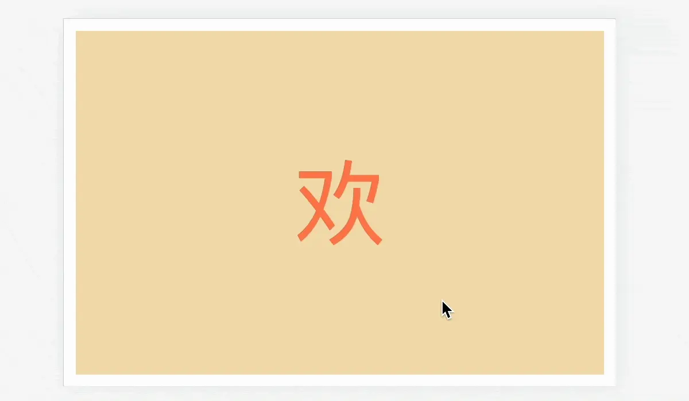

> 文章在个人网站中发布，原文链接：[记录一个纯CSS实现滚动驱动动画的效果](https://blog.zhoujump.club/p/animation-timeline/)
## 先看一下这个简单的案例
### 代码：
你也可以直接划到下边看效果。
```html
<div class="out-cont">
    <!-- 最外层元素，用于框定元素需要固定的距离 -->
    <div class="inner-cont">
        <!-- 内层元素，用于固定元素的位置 -->
        <div class="animation-item">
            <!-- 播放动画的元素内容 -->
        </div>
    </div>
</div>
<style>
.out-cont {
/* 最外层元素，用于框定元素需要固定的距离，这里表示元素将被固定两个屏幕的高度 */
    width: 100%;
    height: 200vh;
    position: relative;
}
.inner-cont {
/* 内层元素，用于固定元素的位置，使用sticky使元素在范围内固定 */
    width: 100%;
    height: 50vh;
    position: sticky;
    top: 25vh;
    display: flex;
    align-items: center;
    justify-content: center;
}
.animation-item{
/* 播放动画的元素内容，使用animation-timeline实现滚动驱动动画 */
    width: 20%;
    aspect-ratio: 1;
    background-color: #2E74B5;
    animation: move 1s linear forwards;
    animation-timeline: view();
    animation-range: contain;
}
@keyframes move {
    0% {
        transform: rotate(0deg);
        border-radius: 8%;
    }
    50% {
        transform: rotate(360deg);
        border-radius: 50%;
    }
    100% {
        border-radius: 8%;
        transform: rotate(720deg);
    }
}
</style>
```
### 效果：
<div class="out-cont">
    <div class="inner-cont">
        <div class="animation-item"></div>
        <div class="animation-view">
            <div class="animation-view-out">
                .out-cont
                <div class="animation-view-inner">
                    .inner-cont
                </div>
            </div>
            <div class="animation-view-screen">
                视口
            </div>
        </div>
    </div>
</div>

## sticky：粘性布局
对于前端码农来说这个玩意并不陌生，所以就只简单介绍一下：  
position:sticky是介于position:relative与position:fixed之间的一种布局方式。当父元素出现在屏幕中时它表现得像fixed，会把自己固定在屏幕上。当父元素出现在屏幕外时它表现得像relative，会按照正常的文档流进行布局，被父容器带走。  
关于这个案例是如何使用sticky实现类似元素固定的效果的，上面效果示例右边有一个简单的展示，可以帮助理解。而且这个展示也是纯css的哦。
> sticky元素的所有父级都不能设置overflow:hidden，这样会使sicky无效，实在需要可以使用overflow:clip代替。

## animation-timeline：滚动驱动动画
这是本案例的核心，元素上使用了这个属性，`@keyframes`定义的css动画将不会自动播放，而是根据滚动条的进度进行滚动。
这个属性有两个主要属性值：
- animation-timeline: view()  
元素进入视口时开始播放动画，离开视口时结束。
- animation-timeline: scroll()  
元素将在整个滚动容器中滚动时播放动画。  
- animation-timeline：cont-name  
命名容器，这个待会展开讲。

<div class="animation-view-2">
    <div class="animation-view-2-item">
        <div class="animation-view-2-screen">
            视口
        </div>
        <div class="animation-view-2-anima anima-1">
            view()
        </div>
    </div>
    <div class="animation-view-2-item">
        <div class="animation-view-2-screen">
            视口
        </div>
        <div class="animation-view-2-anima anima-2">
            scroll()
        </div>
    </div>
</div>

### animation-timeline: scroll()
scroll()是对于整个页面的，相对而言比较简单，用于做一些与全局滚动相关的效果，例如文章阅读进度，这里引用[前端侦探](https://segmentfault.com/blog/xboxyan)的一张图。

scroll()中可以填入两个参数：scroller和axis
- scroller  
scroller参数用于指定滚动容器，默认值为`nearest`。  
如果设置为`nearest`，将会使用最近的祖先滚动容器。  
如果设置为`root`，将会使用文档视口作为滚动容器。  
如果设置为`self`，将会使用元素本身作为滚动容器。  

- axis  
axis参数用于指定滚动轴，默认值为`block`。  
如果设置为`block`，滚动容器的块级轴方向。
如果设置为`inline`，滚动容器内联轴方向。
如果设置为`x`，则元素将在水平方向上滚动。  
如果设置为`y`，则元素将在垂直方向上滚动。  

### animation-range
如果我不想让动画整个滚动期间都播放呢，可以使用`animation-range`属性设置动画的起止位置，`px`，`%`单位均可。  
例如:
``` css
.animation{
    animation-range: 0 100px;
}
```
这样动画就只会在滚动容器滚动到0到100px的位置时播放,在100px之后就不会再播放了。

### animation-timeline：view()
view()是相对于元素与视口的位置的，这个案例就是基于view()的。  
view()中也可以填入两个参数：axios和inset  
- axis  
axis参数用于指定滚动轴，默认值为`block`。  
如果设置为`block`，滚动容器的块级轴方向。
如果设置为`inline`，滚动容器内联轴方向。
如果设置为`x`，则元素将在水平方向上滚动。  
如果设置为`y`，则元素将在垂直方向上滚动。  

- inset  
inset参数用于规定动画从何时开始何时结束，是元素刚冒尖尖就开始还是元素完全进入视口呢，就靠这个属性控制,有点类似于上面`animation-range`的作用。  
inset接受一个或两个值，两个值时代表开始位置和结束位置，`px`，`%`单位均可

### animation-timeline：cont-name
你可能发现了，仅靠上面那些属性，只能实现父元素滚动驱动子元素的动画，要是我需要滚动一个容器去驱动另一个兄弟元素的动画呢？就需要靠命名的容器实现了。  
使用很简单，就是在滚动容器上使用一个属性`scroll-timeline-name`。
``` css
.scroll{
    /* 命名滚动容器 */
    scroll-timeline-name: --my-scroller;
}
.animation{
    /* 需要被驱动动画的元素 */
    animation-timeline: --my-scroller;
}
```
这样`.scroll`容器被滚动时，`.animation`元素就会根据滚动容器的滚动进度进行动画播放。

## 相关知识
[position:fixed](https://developer.mozilla.org/en-US/docs/Web/CSS/position#fixed)  
[animation-timeline](https://developer.mozilla.org/en-US/docs/Web/CSS/animation-timeline)  
[animation-range](https://developer.mozilla.org/en-US/docs/Web/CSS/animation-range)  
[前端侦探](https://segmentfault.com/blog/xboxyan)
<style>
.animation-view-2 {
    font-size: 12px;
    width: 100%;
    display: flex;
    align-items: center;
    justify-content: center;
    height: 320px;
    position: relative;
    gap: 20px;
}
.animation-view-2-anima{
    width: 50px;
    height: 50px;
    color: white;
    text-align: center;
    line-height: 50px;
    background-color: #2E74B5;
}
.animation-view-2-screen{
    position: absolute;
    top: 0;
    left: 0;
    width: 100%;
    height: 80px;
    outline: 2px solid #2E74B5;
    animation: screen-2 2s linear infinite alternate;
}
.anima-1{
    animation: anima-1 2s linear infinite alternate;
}
.anima-2{
    animation: anima-2 2s linear infinite alternate;
}
@keyframes anima-2 {
    0% {
        transform: rotate(0deg);
        border-radius: 0%;
    }
    100% {
        transform: rotate(180deg);
        border-radius: 20%;
    }
}
@keyframes anima-1 {
    0% {
        transform: rotate(0deg);
        border-radius: 0%;
    }
    20% {
        transform: rotate(0deg);
        border-radius: 0%;
    }
    80% {
        border-radius: 20%;
        transform: rotate(180deg);
    }
    100% {
        transform: rotate(180deg);
        border-radius: 20%;
    }
}
@keyframes screen-2 {
    0% {
        top: 0
    }
    100% {
        top: 240px;
    }
}
.animation-view-2-item {
    display: flex;
    align-items: center;
    justify-content: center;
    position: relative;
    width: 100px;
    height: 320px;
    background-color: rgba(0, 0, 0, 0.1);
}
.article-page .main-article{
    overflow: clip;
}
.out-cont {
    width: 100%;
    height: 200vh;
    position: relative;
}
.inner-cont {
    width: 100%;
    height: 50vh;
    position: sticky;
    top: 25vh;
    display: flex;
    align-items: center;
    justify-content: center;
}
.animation-view{
    font-size: 12px;
    position: absolute;
    top: 0;
    right: 0;
    width: 100px;
    height: 320px;
    background-color: rgba(0, 0, 0, 0.1);
}
.animation-view-out{
    position: relative;
    margin-top: 80px;
    width: 100%;
    height: 160px;
    background-color: rgba(0, 0, 0, 0.1);
}
.animation-view-inner{
    width: calc(100% - 4px);
    height: 72px;
    position: absolute;
    top: 2px;
    left: 2px;
    border: 2px solid #2E74B5;
    animation: inner 1s linear both;
    animation-timeline: view();
    animation-range: contain;
    background-color: rgba(0, 0, 0, 0.1);
}
@keyframes inner {
    32% {
        top: 2px
    }
    66% {
        top: 82px;
    }
    100%{
        top: 82px;
    }
}
.animation-view-screen{
    position: absolute;
    top: 0;
    left: 0;
    width: 100%;
    height: 80px;
    outline: 2px solid #2E74B5;
    animation: screen 1s linear both;
    animation-timeline: view();
    animation-range: contain;
}
@keyframes screen {
    0% {
        top: 0
    }
    100% {
        top: 240px;
    }
}
.animation-item{
    width: 20vw;
    aspect-ratio: 1;
    background-color: #2E74B5;
    border-radius: 8%;
    animation: move 1s linear forwards;
    animation-timeline: view();
    animation-range: contain;
}
@keyframes move {
    0% {
        transform: rotate(0deg);
        border-radius: 8%;
    }
    50% {
        transform: rotate(360deg);
        border-radius: 50%;
    }
    100% {
        border-radius: 8%;
        transform: rotate(720deg);
    }
}
</style>
