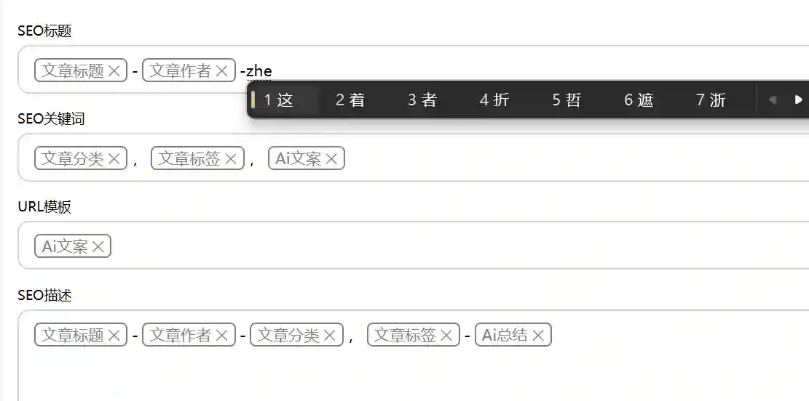
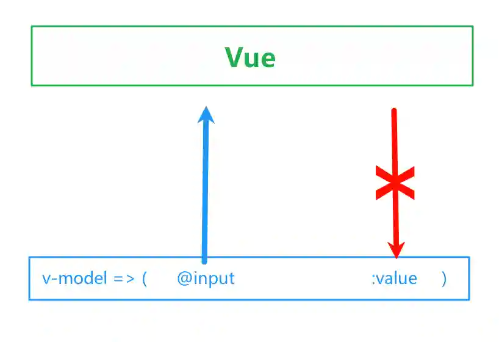

> 文章在个人网站中发布，原文链接：[在vue中contenteditable元素的双向数据绑定](https://blog.zhoujump.club/p/contenteditable-vue/)  

记录一下在vue中使用contenteditable属性所需要注意的地方。
## contenteditable
### 用途
给任何元素加上contenteditable="true"属性，就可以让元素变为可编辑状态。可以实现比普通input、textarea更丰富编辑控件排版。例如这种可以嵌入tag的编辑框。

### 特点
仅添加contenteditable属性而不赋予值，将视为contenteditable="false"。  
若contenteditable="true"的容器中存在contenteditable="false"的元素，那么那个元素本身将不能编辑，不过按下退格能将整个元素一起删除。  
若contenteditable="true"的容器中存在普通的元素，那么按退格将按html的结构删除文本。直到删除至最里层的元素没有文字之后，将会删除元素标签本身。
## 关于Vue的绑定  
### v-model
v-model本质是自动绑定input事件和value属性。虽然contenteditable将赋予元素input事件，但是既然都需要contenteditable属性了，这个元素大概率是没有value属性的。所以大部分情况下v-model只能将元素内容给到vue，但vue无法更新元素的内容。  

这时候如果理所当然的去绑定值：
```vue
<span contenteditable="true" v-model="item.value" v-html="item.value"></span>
```
或者
```vue
<span contenteditable="true" v-model="item.value">{{item.value}}</span>
```
就会发现根本无法正常输入。每次按下按键后，光标将会回到元素开头。如果是使用拼音输入法，问题将会更加鬼畜。

这是因为input事件是每次按键都会触发的，每次按键都会把当前所见的所有内容给到vue处理。同时模板语法`{{}}`或者`v-html`标记的内容将会被vue更新，整个元素的内容都会被替换，自然无法正常输入了。  
解决方法很简单，我们不要使用`v-model`或者`v-input`来更新数据了，应该挑一个更合适的时机来更新数据，例如输入框失焦时更新数据。
```vue
<span contenteditable="true" @blur="item.value=$event.target.innerText">{{item.value}}</span>
```
不出意外输入框此时就能正常双向绑定数据了

## 相关知识
[contenteditable](https://developer.mozilla.org/zh-CN/docs/Web/HTML/Reference/Global_attributes/contenteditable)  
[v-model](https://cn.vuejs.org/guide/components/v-model)  
[blur](https://developer.mozilla.org/zh-CN/docs/Web/API/Element/blur_event)
