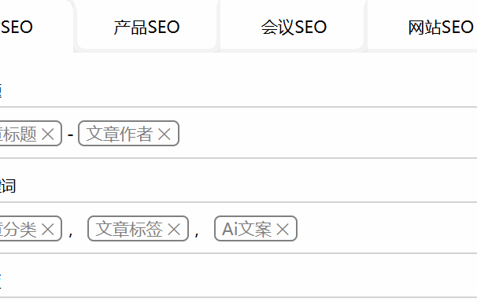

> This article is published on my personal website, original link: [Two-way data binding of contenteditable elements in Vue](https://blog.zhoujump.club/en/p/contenteditable/)

A record of what to pay attention to when using the contenteditable attribute in Vue.
## contenteditable
### Usage
Adding contenteditable="true" attribute to any element can make the element editable. It can achieve richer editing control layout than ordinary input and textarea. For example, an editor that can embed tags like this:

### Features
If the contenteditable attribute is only added without assigning a value, it will be regarded as contenteditable="false".
If there is an element with contenteditable="false" in a container with contenteditable="true", then the element itself cannot be edited, but pressing backspace can delete the entire element.
If there is an ordinary element in a container with contenteditable="true", then pressing backspace will delete the text according to the HTML structure. Until the innermost element has no text, the element tag itself will be deleted.
## About Vue binding
### v-model
v-model essentially automatically binds the input event and value attribute. Although contenteditable will give the element an input event, since the contenteditable attribute is needed, this element is likely to have no value attribute. So in most cases, v-model can only pass the element content to Vue, but Vue cannot update the element content.

At this time, if you naturally bind the value:
```vue
<span contenteditable="true" v-model="item.value" v-html="item.value"></span>
```
Or
```vue
<span contenteditable="true" v-model="item.value">{{item.value}}</span>
```
You will find that you cannot input normally at all. Every time a key is pressed, the cursor will return to the beginning of the element. If you use Pinyin input method, the problem will be even more bizarre.

This is because the input event is triggered every time a key is pressed, and every time a key is pressed, all the content currently seen will be given to Vue for processing. At the same time, the content marked by the template syntax `{{}}` or `v-html` will be updated by Vue, and the entire element's content will be replaced, so it is naturally impossible to input normally.
The solution is very simple, we should not use `v-model` or `v-input` to update data, but should choose a more appropriate time to update data, such as when the input box loses focus.
```vue
<span contenteditable="true" @blur="item.value=$event.target.innerText">{{item.value}}</span>
```
Unexpectedly, the input box can now bind data two-way normally.

## Related knowledge
[contenteditable](https://developer.mozilla.org/zh-CN/docs/Web/HTML/Reference/Global_attributes/contenteditable)
[v-model](https://cn.vuejs.org/guide/components/v-model)
[blur](https://developer.mozilla.org/zh-CN/docs/Web/API/Element/blur_event)