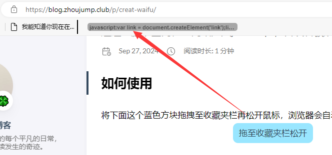
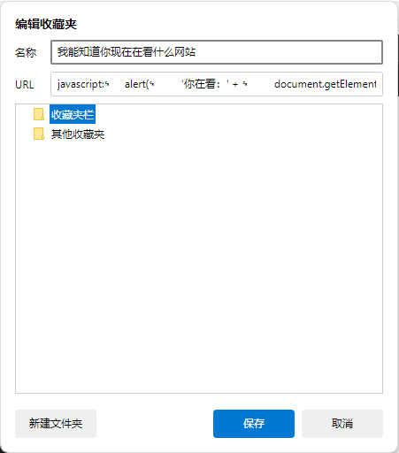
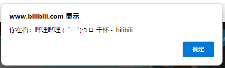

Original link: https://blog.zhoujump.club/en/p/creat-waifu/

## How to use
Drag the blue square below to the favorites bar and release the mouse, the browser will automatically create a bookmark.
<a class="waifu" href="javascript:var link = document.createElement('link');link.rel = 'stylesheet';link.href = 'https://cdn.jsdelivr.net/npm/font-awesome/css/font-awesome.min.css';var script = document.createElement('script');script.src = 'https://fastly.jsdelivr.net/gh/lrplrplrp/bkyl2d@main/loads.js';document.head.appendChild(link);document.head.appendChild(script);"></a> <style> .waifu{ margin: auto; background:#99e6ff; display: block; width: 160px; height: 40px; border-radius: 10px; line-height:40px; text-align:center; cursor: grab;}
.waifu::before{content: 'Drag to the favorites bar';}
.waifu:hover::before{content: 'Press and hold the left mouse button to drag';}
.waifu:active::before{content: 'Drag to the favorites bar and release';}
</style>


Then we open a website at random, click this bookmark, and the poster girl will appear on the web page!


>This method can only be used for PC browsers, not mobile phones. <br/>
And some websites, such as Bing, will prohibit loading external resources, and these websites will fail to summon. <br/>
Baidu, Bilibili, Think No, and Nuggets can all be used. <br/>
Loading may be a bit slow, so you need to wait patiently.

## How it is implemented
In addition to collecting URLs, the browser's favorites can also collect javascript codes. We can execute the javascript code by clicking on it.

Like the example below:
```javascript
javascript:
alert(
'You are looking at:' +
document.getElementsByTagName('title')[0].innerText
)
```
We copy these codes and create a new bookmark, paste the code into the `URL` column and save it.


Then we open a website at random and click on this bookmark, and a dialog box will pop up to display the title of the current web page.


However, if the code you execute has a return value, you need to add a line `void(0);` at the end of the js code, otherwise clicking the bookmark will jump to another page and display the return value on that page.
## The principle of summoning the poster girl
The code is as follows:
```javascript
javascript:
var link = document.createElement('link');
link.rel = 'stylesheet';
link.href = 'https://cdn.jsdelivr.net/npm/font-awesome/css/font-awesome.min.css';
var script = document.createElement('script');
script.src = 'https://fastly.jsdelivr.net/gh/lrplrplrp/bkyl2d@main/loads.js';
document.head.appendChild(link);
document.head.appendChild(script);
```
The code adds two tags to the `head` tag, a `link` tag and a `script` tag. They will load the styles required by the poster girl and the initialization code of the poster girl, so that the poster girl will appear on your web page.
>ps: Direct dragging and dropping is a good way to bookmark a link with one click.
