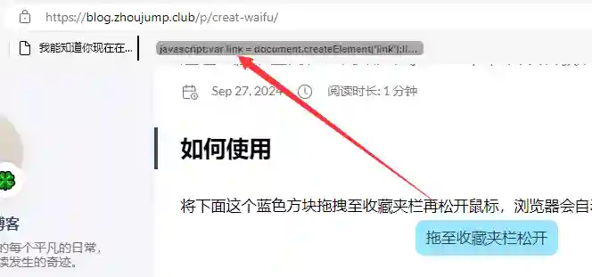
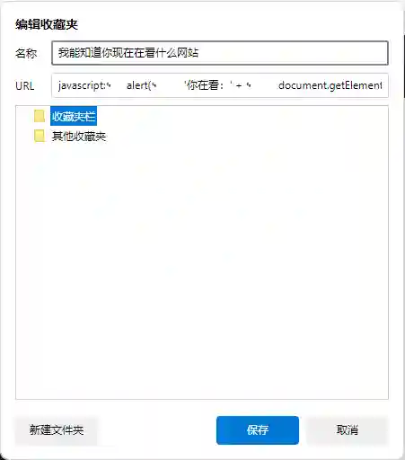
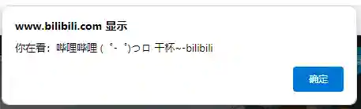

> 文章在个人网站中发布，原文链接：[随时随地，一键召唤看板娘。](https://blog.zhoujump.club/p/creat-waifu/)

## 如何使用
将下面这个蓝色方块拖拽至收藏夹栏再松开鼠标，浏览器会自动创建一个书签。
<a class="waifu" href="javascript:var link = document.createElement('link');link.rel = 'stylesheet';link.href = 'https://cdn.jsdelivr.net/npm/font-awesome/css/font-awesome.min.css';var script = document.createElement('script');script.src = 'https://fastly.jsdelivr.net/gh/lrplrplrp/bkyl2d@main/loads.js';document.head.appendChild(link);document.head.appendChild(script);"></a>
<style>
.waifu{
    margin: auto;
    background:#99e6ff;
    display: block;
    width: 160px;
    height: 40px;
    border-radius: 10px;
    line-height:40px;
    text-align:center;
    cursor: grab;}
.waifu::before{content: '拖拽至收藏夹栏';}
.waifu:hover::before{content: '按住鼠标左键拖拽';}
.waifu:active::before{content: '拖至收藏夹栏松开';}
</style>


然后我们随意打开一个网站，点击这个书签，看板娘就会出现在网页上啦！


>这个方法只能用于PC端的浏览器，手机是不可以的。<br/>
而且某些网站例如必应，会禁止加载外部资源，这些网站会召唤失败。<br/>
百度，B站，思否，掘金都是可以使用的。<br/>
加载可能有点慢，需要耐心等待。

## 它是如何实现的
浏览器的收藏夹除了可以收藏网址，还可以收藏javascript代码。我们可以通过点击收藏的javascript代码来执行它。

就像下边这个例子：
```javascript
javascript:
    alert(
        '你在看：' + 
        document.getElementsByTagName('title')[0].innerText
    )
```
我们复制这些代码然后新建一个书签，将代码粘贴进`URL`这一栏里然后保存。


然后我们随意打开一个网站，点击这个书签，就会弹出一个对话框，显示当前网页的标题。


不过如果你执行的代码具有返回值，那么就需要在js代码最后添加一行`void(0);`，否则点击书签将会跳转到另一个页面，在那个页面上显示返回值。
## 召唤看板娘的原理
代码如下：
```javascript
javascript:
var link = document.createElement('link');
link.rel = 'stylesheet';
link.href = 'https://cdn.jsdelivr.net/npm/font-awesome/css/font-awesome.min.css';
var script = document.createElement('script');
script.src = 'https://fastly.jsdelivr.net/gh/lrplrplrp/bkyl2d@main/loads.js';
document.head.appendChild(link);
document.head.appendChild(script);
```
代码向`head`标签中添加了两个标签，一个`link`标签和一个`script`标签。他们将会加载看板娘所需样式和看板娘的初始化代码，这样看板娘就出现在你的网页上了。
>ps:直接拖拽是将一个链接一键添加书签的好方法。
