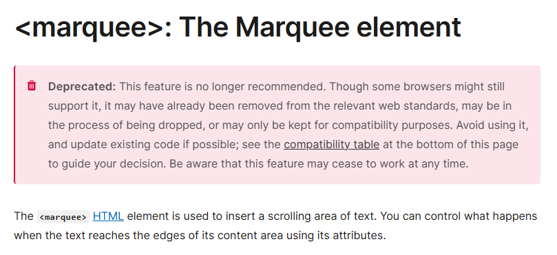

## See the effect first
<div class="marquee">
<span>I am a personal intern who has been practicing marketing for two and a half years. I like html, css, and js. </span>
<span>I am a personal intern who has been practicing marketing for two and a half years. I like html, css, and js. </span>
</div>
<style>
.marquee {
overflow: hidden;
white-space: nowrap;
width: 400px;
display: flex;
}
.marquee span {
animation: marquee 10s linear infinite;
}
@keyframes marquee {
100% {transform: translateX(-100%);}
}
</style>

## `<marquee>` tag
At this time, some front-end bosses will stand up and say, isn't this just a matter of `<marquee>` tag?
However, this element has been abandoned. Although it can still be used, it may be removed by mainstream browsers one day. It is better to use it less


## Use CSS animation
### Apply animation to text
Since the marquee simply scrolls the text horizontally, we can use CSS animation to achieve it.
Let's set a piece of text first, and then apply animation to it.

<div class="marquee-1">
  <span>I am a personal intern who has been practicing the market for two and a half years. I like html, css, and js. </span>
</div>
<style>
.marquee-1 {
  overflow: hidden;
  width: 300px;
  display: flex;
}
.marquee-1 span {
  animation: marquee 10s linear infinite;
}
@keyframes marquee {
  100% {transform: translateX(-100%);}
}
</style>

``` html
<div class="marquee-1">
<span>I am a personal intern who has been practicing the market for two and a half years. I like html, css, and js. </span>
</div>
<style>
.marquee-1 {
overflow: hidden;
width: 300px;
display: flex;
}
.marquee-1 span {
animation: marquee 10s linear infinite;
}
@keyframes marquee {
100% {transform: translateX(-100%);}
}
</style>
```
It looks like the text wraps after it exceeds the container.
### Force the text to not wrap
Then we force the text to not wrap. See the effect

<div class="marquee-2">
  <span>I am a personal intern who has been practicing marketing for two and a half years. I like html, css, and js. </span>
</div>
<style>
.marquee-2 {
  overflow: hidden;
  white-space: nowrap;
  width: 300px;
  display: flex;
}
.marquee-2 span {
  animation: marquee 10s linear infinite;
}
@keyframes marquee {
  100% {transform: translateX(-100%);}
}
</style>

``` html
<div class="marquee-2">
  <span>I am a personal intern who has been practicing marketing for two and a half years. I like html, css, and js. </span>
</div>
<style>
.marquee-2 {
  overflow: hidden;
  /* You can force the text not to wrap here */
  white-space: nowrap;
  width: 300px;
  display: flex;
}
.marquee-2 span {
  animation: marquee 10s linear infinite;
}
@keyframes marquee {
  100% {transform: translateX(-100%);}
}
</style>
```
Now it looks a bit interesting, that is, the text will not start to scroll again until it is completely scrolled.
## Copy an element to achieve seamless scrolling
We can copy an element and then let the animation run at the same time, so that it looks like seamless scrolling. The complete code is below.

<div class="marquee">
<span>I am a personal intern who has been practicing marketing for two and a half years. I like html, css, and js. </span>
<span>I am a personal intern who has been practicing the market for two and a half years. I like html, css, and js. </span>
</div>
<style>
.marquee {
overflow: hidden;
white-space: nowrap;
width: 400px;
display: flex;
}
.marquee span {
animation: marquee 10s linear infinite;
}
@keyframes marquee {
100% {transform: translateX(-100%);}
}
</style>

``` html
<div class="marquee">
  <span>I am a personal intern who has been practicing the market for two and a half years. I like html, css, and js. </span>
  <span>I am a personal intern who has been practicing the market for two and a half years. I like html, css, and js. </span>
</div>
<style>
.marquee{
  overflow: hidden;
  white-space: nowrap;
  width: 400px;
  display: flex;
}
.marquee span{
  animation: marquee 10s linear infinite;
}
@keyframes marquee{
  100% {transform: translateX(-100%);}
}
</style>
```
## Related knowledge
[marquee: marquee element](https://developer.mozilla.org/zh-CN/docs/Web/HTML/Element/marquee)<br/>
[white-space](https://developer.mozilla.org/zh-CN/docs/Web/CSS/white-space)