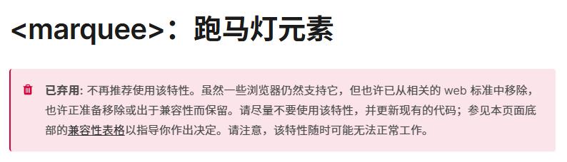

> 文章在个人网站中发布，原文链接：[纯css实现跑马灯效果](https://blog.zhoujump.club/p/css-marquee/)

## 先看效果
<div class="marquee">
  <span>我是练习市场两年半的个人实习生，喜欢html、css、js。</span>
  <span>我是练习市场两年半的个人实习生，喜欢html、css、js。</span>
</div>
<style>
  .marquee {
    overflow: hidden;
    white-space: nowrap;
    width: 400px;
    display: flex;
  }
  .marquee span {
    animation: marquee 10s linear infinite;
  }
  @keyframes marquee {
    100% {transform: translateX(-100%);}
  }
</style>

## `<marquee>`标签
这时候一些前端大佬就会站起来说了，这不就是一个`<marquee>`标签的事吗？  
不过这个元素目前已经被废弃了，虽然还能继续使用，但保不齐哪天就被主流浏览器移除了。我们还是少用为妙


## 使用css动画
### 为文字应用动画
既然跑马灯只是简单的将文本水平滚动，那么我们可以使用css动画来实现。
我们先设置一段文本，然后为其应用动画。

<div class="marquee-1">
  <span>我是练习市场两年半的个人实习生，喜欢html、css、js。</span>
</div>
<style>
  .marquee-1 {
    overflow: hidden;
    width: 300px;
    display: flex;
  }
  .marquee-1 span {
    animation: marquee 10s linear infinite;
  }
  @keyframes marquee {
    100% {transform: translateX(-100%);}
  }
</style>

``` html
<div class="marquee-1">
  <span>我是练习市场两年半的个人实习生，喜欢html、css、js。</span>
</div>
<style>
  .marquee-1 {
    overflow: hidden;
    width: 300px;
    display: flex;
  }
  .marquee-1 span {
    animation: marquee 10s linear infinite;
  }
  @keyframes marquee {
    100% {transform: translateX(-100%);}
  }
</style>
```
看起来文字在超出容器后折行了。
### 强制使文字不换行
然后我们强制使文字不换行。看看效果

<div class="marquee-2">
  <span>我是练习市场两年半的个人实习生，喜欢html、css、js。</span>
</div>
<style>
  .marquee-2 {
    overflow: hidden;
    white-space: nowrap;
    width: 300px;
    display: flex;
  }
  .marquee-2 span {
    animation: marquee 10s linear infinite;
  }
  @keyframes marquee {
    100% {transform: translateX(-100%);}
  }
</style>

``` html
<div class="marquee-2">
  <span>我是练习市场两年半的个人实习生，喜欢html、css、js。</span>
</div>
<style>
  .marquee-2 {
    overflow: hidden;
    /* 这里可以强制使文字不换行 */
    white-space: nowrap;
    width: 300px;
    display: flex;
  }
  .marquee-2 span {
    animation: marquee 10s linear infinite;
  }
  @keyframes marquee {
    100% {transform: translateX(-100%);}
  }
</style>
```
现在看起来有那么点意思了，就是文字完全滚完之后才会重新开始滚动。
## 复制一份元素来实现无缝滚动
我们可以复制一份元素，然后让动画同时进行，这样看起来就像在无缝滚动了。完整代码在下边。

<div class="marquee">
  <span>我是练习市场两年半的个人实习生，喜欢html、css、js。</span>
  <span>我是练习市场两年半的个人实习生，喜欢html、css、js。</span>
</div>
<style>
  .marquee {
    overflow: hidden;
    white-space: nowrap;
    width: 400px;
    display: flex;
  }
  .marquee span {
    animation: marquee 10s linear infinite;
  }
  @keyframes marquee {
    100% {transform: translateX(-100%);}
  }
</style>

``` html
<div class="marquee">
  <span>我是练习市场两年半的个人实习生，喜欢html、css、js。</span>
  <span>我是练习市场两年半的个人实习生，喜欢html、css、js。</span>
</div>
<style>
  .marquee {
    overflow: hidden;
    white-space: nowrap;
    width: 400px;
    display: flex;
  }
  .marquee span {
    animation: marquee 10s linear infinite;
  }
  @keyframes marquee {
    100% {transform: translateX(-100%);}
  }
</style>
```

## 相关知识

[marquee：跑马灯元素](https://developer.mozilla.org/zh-CN/docs/Web/HTML/Element/marquee)<br/>
[white-space](https://developer.mozilla.org/zh-CN/docs/Web/CSS/white-space)