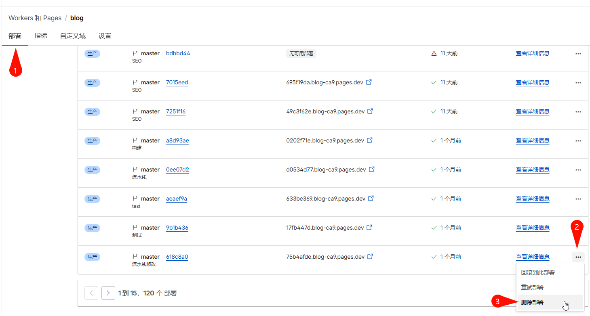

> This article was originally published on my personal website: [Deleting Cloudflare Pages projects with many deployments](https://blog.zhoujump.club/en/p/delete-cloudflare-project/)

## Small number of deployments
If your deployment count is only one or two hundred, you can try manually deleting old deployments. Delete until the deployment count is less than one hundred, and then you should be able to delete the project.

## Large number of deployments
You need to use Cloudflare's API to delete deployments, and you need to install [Cloudflare CLI](https://developers.cloudflare.com/workers/wrangler/install-and-update/) to perform this operation.  
This part has been covered by others in tutorials, so I won't repeat it here. You can refer to [this article](https://furrycon.top/posts/80caf843).