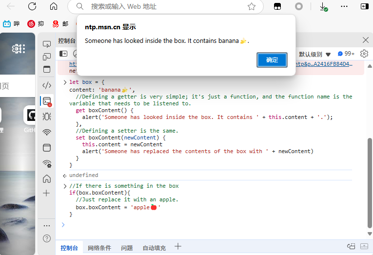

I believe that all the front-end experts and novices have heard this statement:
> Vue 2 uses getters and setters to control data, while Vue 3 directly uses proxy. 

Surely, there are many people like me who just want to enjoy using Vue without caring about getters or proxies. However, these things are very practical in actual development and can achieve some very elegant encapsulations. But first, let's get to know these two things. 

# Getter and setter

Getter and setter are like listeners. When a certain piece of data is modified or read, the getters and setters you have set will run. 

For example, I have now defined a box, and the content inside it is a 'banana🍌'. 
``` javascript
let box = {
  content: 'banana🍌'
}
```


Let's try to monitor this box. 
``` javascript
let box = {
content: 'banana🍌',
  //Defining a getter is very simple; it's just a function, and the function name is the variable that needs to be listened to.
  get boxContent() {
    alert('Someone has looked inside the box. It contains ' + this.content + '.'); 
  },
  //Defining a setter is the same.
  set boxContent(newContent) {
    this.content = newContent
    alert('Someone has replaced the contents of the box with ' + newContent) 
  }
}
```
One point to note here is that the names of getters and setters cannot be the same as the original variable. However, in the Firefox browser, this is allowed. But for compatibility reasons, we do not recommend doing so. 

At this point, as soon as someone attempts to read from or modify boxContent, the getter and setter will be triggered.
``` javascript
//If there is something in the box
if(box.boxContent){
  //Just replace it with an apple.
  box.boxContent = 'apple🍎'
}
```
The first line's `if` reads `box.boxContent`, triggering the getter, and then a prompt pops up. 

Immediately after we modified box.boxContent, the setter was triggered and a prompt popped up. 


Great! You've learned getters and setters. Let's implement a small Vue now.
## Implementing a Tiny Vue
Let's take a classic example: Xiaohei's Notepad: <iframe style="width:100%; aspect-ratio:2/1; border:none;" src="https://code.juejin.cn/pen/7481263034367737865"></iframe>


I won't elaborate on the style and layout as they are quite simple. You can check the specific code on [GitHub](https://github.com/ZhouJump/blog/blob/master/content/post/getter-setter/demo/index.html) or on [code.juejin](https://code.juejin.cn/pen/7481263034367737865). 

It's said to be a mini Vue implementation, but in reality, it's just an attempt to replicate the v-model functionality through getters and setters. After all, we're not Evan You, so let's keep it simple.
``` html
<! DOCTYPE html>
<html>
  <head>
    <meta charset="utf-8">
    <link rel="stylesheet" href="style.css">
    <title>Demo</title>
  </head>
  <body>
    <div class="outter">
      <div class="title">Demo</div>
      <div class="list">
        <div class="item">
          <span>2333</span>
          <button class="delete">Delete</button>
        </div>
      </div>
      <div class="add">
        <!-- We set a bind attribute, which is equivalent to v-model, and bind it to the input variable --> 
        <input bind="input"/>
        <button onclick="add()" class="add-btn">Add</button>
      </div>
        <!-- Here's another bind, also bound to the input variable -->
        <div>The value of input: <span bind="input"></span>
      </div>
    </div>
  </body>
<script src="index.js"></script>
</html>
```
The JavaScript part is as follows. We only focus on the first part. 

``` javascript
//Let's define the data first. 
let data = {
  list:[],
  input:''
}


// Implement binding
// Here, obtain all elements that have the "bind" attribute
let binds = document.querySelectorAll('[bind]');
// Traverse these elements
binds.forEach((item) => {
  // Bind the input event
  item.oninput = (e) => {
    //Update its value when input.
    data[item.getAttribute('bind')] = e.target.value
  }
})


// Implement data listening
let myData = {}
//Since getters and setters cannot have the same name as the original variable, let's wrap the original variable up.
myData.data = data
//We iterate through each object in data.
for(let item in data){
  //Define a getter and setter for each item.
  Object.defineProperty(myData, item, {
  //Here, getters and setters are set through defineProperty.
  get(){
    return myData.data[item]
  },
  set(val){
  myData.data[item] = val
    //When the value is updated, we traverse all elements with the bind attribute.
    binds.forEach((bindsItem) => {
      //If this element has a bind attribute and the attribute name is equal to "item", modify its value.
      if(bindsItem.getAttribute('bind') === item){
        bindsItem.value = val
        bindsItem.innerHTML = val
      }
    })
    //When the list is updated, re-render the list.
    if(item === 'list') {
      renderList()
    }
  }
  })
}
//Assign `myData` to `data`, and in this way, our `data` becomes a proxy object.
data = myData


// Those interested can take a look at the following code. 

// Render list function function renderList() {
const listContainer = document.querySelector('.list')
listContainer.innerHTML = data.list.map((item, index) => `
  <div class="item">
    <span>${item}</span>
    <button class="delete" onclick="deleteItem(${index})">Delete</button>
  </div>
`).join('')
}


// Function to add a project function add() {
if(data.input.trim()) {
  data.list = [...data.list, data.input]
  data.input = '' // Clear the input box }
}


// Function to delete an item function
deleteItem(index) {
  data.list = data.list.filter((_, i) => i ! == index)
}
```


## Let's take a look at the effect
In this way, we have implemented a v-model using native JavaScript. Don't you feel a great sense of achievement?
 

## Relevant Knowledge
[getter](https://developer.mozilla.org/zh-CN/docs/Web/JavaScript/Reference/Functions/get)<br/>
[setter](https://developer.mozilla.org/zh-CN/docs/Web/JavaScript/Reference/Functions/set)<br/>
[defineProperty](https://developer.mozilla.org/zh-CN/docs/Web/JavaScript/Reference/Global_Objects/Object/defineProperty)