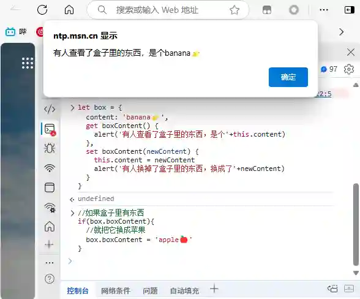
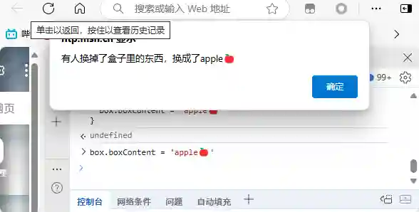

> 文章在个人网站中发布，原文链接：[自己写一个小小vue - getter与setter](https://blog.zhoujump.club/p/getter-setter/)

我相信各位前端大佬和小佬们都听过这句话：
> vue2使用getter与setter来控制数据，vue3则直接使用proxy。

肯定有很多人像我一样，只管爽用vue就行，我管你什么getter、proxy的。不过这个东西在实际开发中是非常实用的，可以实现一些非常优雅的封装。不过首先，让我们先了解一下这俩东西。

## getter与setter
这俩东西就相当于一个监听器，当某个数据被修改或者被读取时，你设置的getter和setter就会运行。

例如我现在定义了一个box(盒子)，里边的content(内容)是一个‘banana🍌’
``` javascript
let box = {
  content: 'banana🍌'
}
```

我们试试监听这个盒子
``` javascript
let box = {
  content: 'banana🍌',
  // 定义getter非常简单,就是一个函数,函数名就是需要被监听的变量
  get boxContent() {
    alert('有人查看了盒子里的东西，是个'+this.content)
  },
  // 定义setter也是一样
  set boxContent(newContent) {
    this.content = newContent
    alert('有人换掉了盒子里的东西，换成了'+newContent)
  }
}
```
> 这里有个需要注意的点就是getter和setter的名字不能和原变量相同,不过在firefox浏览器中却是可以这么写的,不过鉴于兼容性原因我们不建议这么写

这时候一旦有人尝试读取和修改boxContent，就会触发getter和setter。
``` javascript
//如果盒子里有东西
if(box.boxContent){
  //就把它换成苹果
  box.boxContent = 'apple🍎'
}
```
第一行的if读取了box.boxContent，触发getter，然后弹出提示。

紧接我们修改了box.boxContent，触发setter，然后弹出提示。


好了，你已经学会了getter和setter了，让我们来实现一个vue把。
## 实现一个小小vue
来个经典案例,小黑记事本:
<iframe style="width:100%;aspect-ratio:2/1;border:none;" src="https://code.juejin.cn/pen/7481263034367737865"></iframe>

样式布局我不多赘述，都挺简单的。具体代码可以上码上掘金或者来[github](https://github.com/ZhouJump/blog/blob/master/content/post/getter-setter/demo/index.html)查看

说是实现小小vue，实际上只是通过getter和setter来尝试实现v-model的功能，毕竟咱也不是尤雨溪，咱就来简单点的。
``` html
<!DOCTYPE html>
<html>
  <head>
    <meta charset="utf-8">
    <link rel="stylesheet" href="style.css">
    <title>Demo</title>
  </head>
  <body>
    <div class="outter">
      <div class="title">Demo</div>
      <div class="list">
        <div class="item">
          <span>2333</span>
          <button class="delete">Delete</button>
        </div>
      </div>
      <div class="add">
        <!-- 我们设置一个bind属性，它就相当于v-model，绑定到input变量 -->
        <input bind="input"/>
        <button onclick="add()" class="add-btn">Add</button>
      </div>
      <!-- 这里也来一个bind，也绑定到input变量 -->
      <div>input的值:<span bind="input"></span></div>
    </div>
  </body>
  <script src="index.js"></script>
</html>
```
js部分如下，我们只关注前面部分

``` javascript
// 我们先定义好数据
let data = {
  list:[],
  input:''
}

// 实现绑定
// 此处获得所有拥有bind属性的元素
let binds = document.querySelectorAll('[bind]');
// 遍历这些元素
binds.forEach((item) => {
  // 绑定input事件
  item.oninput = (e) => {
    // 当input时更新其值
    data[item.getAttribute('bind')] = e.target.value
  }
})

// 实现数据监听
let myData = {}
// 因为getter和setter不能和原变量同名，咱把原变量包裹起来一下
myData.data = data
// 我们遍历data里的每个对象
for(let item in data){
  //为每个item都定义一个getter和setter
  Object.defineProperty(myData, item, {
    // 这里通过defineProperty来设置getter和setter
    get(){
      return myData.data[item]
    },
    set(val){
      myData.data[item] = val
      // 当值更新时，我们遍历所有有bind属性的元素
      binds.forEach((bindsItem) => {
        // 如果这个元素有bind属性，并且属性名等于item，就修改它的值
        if(bindsItem.getAttribute('bind') === item){
          bindsItem.value = val
          bindsItem.innerHTML = val
        }
      })
      // 当 list 更新时，重新渲染列表
      if(item === 'list') {
        renderList()
      }
    }
  })
}
// 把myData赋值给data，这样我们的data就变成一个代理对象了
data = myData

//之后的代码感兴趣的可以看看

// 渲染列表函数
function renderList() {
  const listContainer = document.querySelector('.list')
  listContainer.innerHTML = data.list.map((item, index) => `
    <div class="item">
      <span>${item}</span>
      <button class="delete" onclick="deleteItem(${index})">Delete</button>
    </div>
  `).join('')
}

// 添加项目函数
function add() {
  if(data.input.trim()) {
    data.list = [...data.list, data.input]
    data.input = '' // 清空输入框
  }
}

// 删除项目函数
function deleteItem(index) {
  data.list = data.list.filter((_, i) => i !== index)
}
```

## 看看效果
这样我们就用原生js实现了一个v-modle，是不是成就感满满呢


## 相关知识
[getter](https://developer.mozilla.org/zh-CN/docs/Web/JavaScript/Reference/Functions/get)<br/>
[setter](https://developer.mozilla.org/zh-CN/docs/Web/JavaScript/Reference/Functions/set)<br/>
[defineProperty](https://developer.mozilla.org/zh-CN/docs/Web/JavaScript/Reference/Global_Objects/Object/defineProperty)
