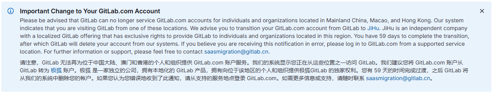

## Cause
Because one day when I logged into gitlab, I found that I was issued a 60-day death notice, and the account would be deleted in two months, so the site relocation was put on the agenda.

Of course, it is impossible to krypton gold, so I set my sights on the cyber living Buddha cloudflare.
## Steps
### Transfer warehouse
Gitlab wants to delete my warehouse, so the first priority is of course to transfer the warehouse first, and I am transferring it to github here. The process is very simple. Select Import Repository and fill in the original repository address and account password.

### Configure Cloudflare Pages
The operation is also very simple. Prepare a cloudflare account in advance, open the pages page, link to git, and log in.

Then select the corresponding repository, select the corresponding framework preset, and click Next to start building.
> If an error occurs during the build, it may be a problem with the hugo version. Add an environment variable named `HUGO_VERSION` and fill in the hugo version you are currently using.
>

### Configure Domain Name
After the build is complete, you can see this page. Enter the configuration page, select Custom Domain, click Set Custom Domain, and then enter the domain name. Because my domain name is in cloudflare, it can take effect directly. If the domain name is in other domain name providers, just follow the prompts to add a cname resolution.

At this point, the transfer has been completed. It is still the original domain name and the original website, but the website has been quietly moved.
