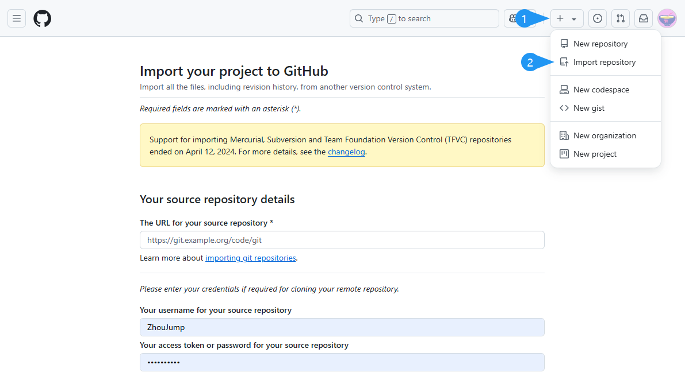
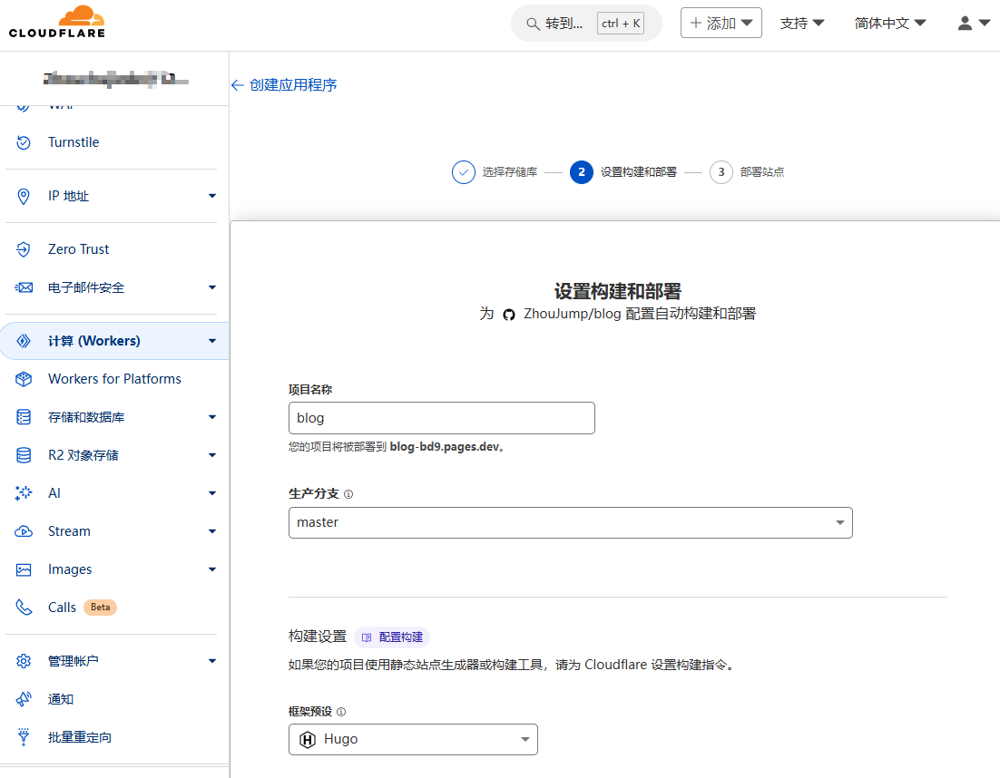

## 起因
因为某一天在gitlab上号时发现被下发了60天死亡通知，账号会在两个月后被删除，所以网站搬家就被提上了日程。  

当然氪金是不可能氪金的，于是把主意打到了赛博活佛cloudflare身上。
## 步骤
### 转移仓库
gitlab想要删我的仓库，当务之急当然是先转移仓库，我这里是转移至github。过程很简单，选择导入仓库，然后填写原仓库的地址和账号密码即可。

### 配置Cloudflare Pages
操作也是非常简单。提前准备一个cloudflare账号，打开pages页面，然后链接到git，进行登录。

然后选择相应的仓库，选择对应的框架预设，然后点击下一步就会开始构建。
> 如果构建发生错误，有可能是hugo版本的问题，添加一个名为`HUGO_VERSION`的环境变量，填入你目前正在使用的hugo版本即可。
> 

### 配置域名
构建完成后就能看到这个pages了，进入配置页，选择 自定义域 ，点击 设置自定义域 然后输入域名即可。因为我的域名就在cloudflare，所以可以直接生效，若域名在其它域名商那，按照提示添加一个cname解析就好。  
  
至此，转移工作已经完成，还是原来的域名，原来的网站，但是网站已经悄悄迁移了。