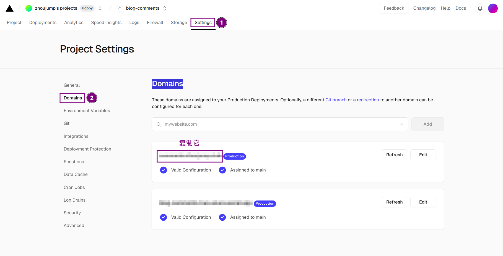
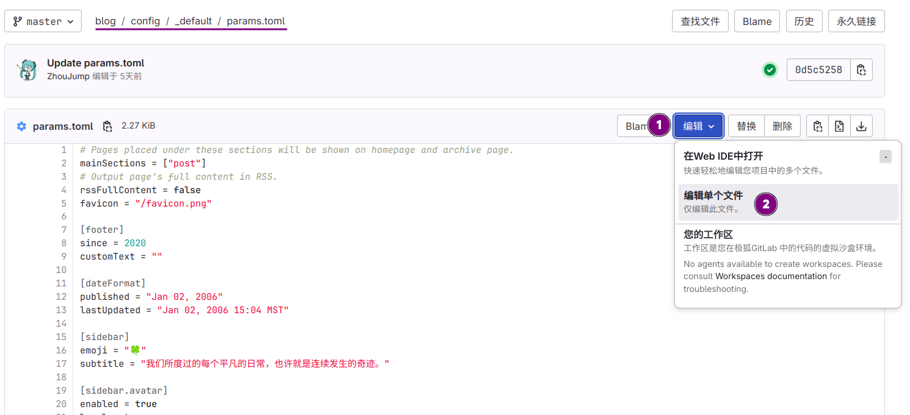

>Foreword: This article continues the previous article and talks about how to add a comment system to your blog.
>[Read the previous article](/tags/hugo/)

## Deploy waline

This part is introduced in detail on the waline official website. We only need to do **Vercel deployment (server)**. Friends who have purchased domain names can do one more step. After completing the deployment, you can return to this article to continue configuration.
[Click to go to waline tutorial](https://waline.js.org/guide/get-started/)
>If you have difficulty accessing vercel, please use magic Internet.


## Deploy hugo

>We assume that you have configured hugo completely according to the tutorial and have not used other hugo themes.

Enter the deployed vercel project and select **Settings>Domains** to go to the domain name management interface and copy a domain name for backup.



Go to gitlab, find the `config/_default/params.toml` file, and edit the code starting from line 107



```go
[comments.waline]
serverURL = "domain.com"//Fill in the domain name you copied in the previous step
lang = "zh-CN"
visitor = ""
avatar = ""
emoji = ["https://unpkg.com/@waline/emojis@1.1.0/weibo"]
meta = ['nick', 'mail']//Fill in the information you want users to leave
requiredMeta = ['nick']//Fill in the required information for users, and anonymous is allowed if it is empty
placeholder = "Leave your comment!"
```

Then there is the code on line 77

```go
## Comments
[comments]
enabled = true
provider = "waline"
```

For more information about the configuration here, please click here

After editing, save it. Wait for the pipeline to run, and then you can see the comment area appear at the end of the article.
