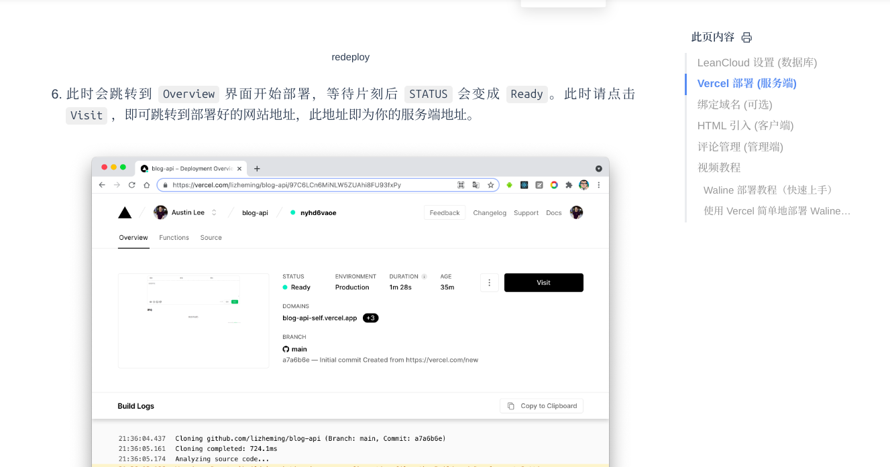
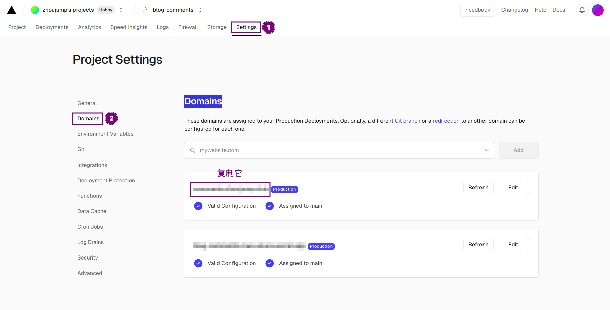
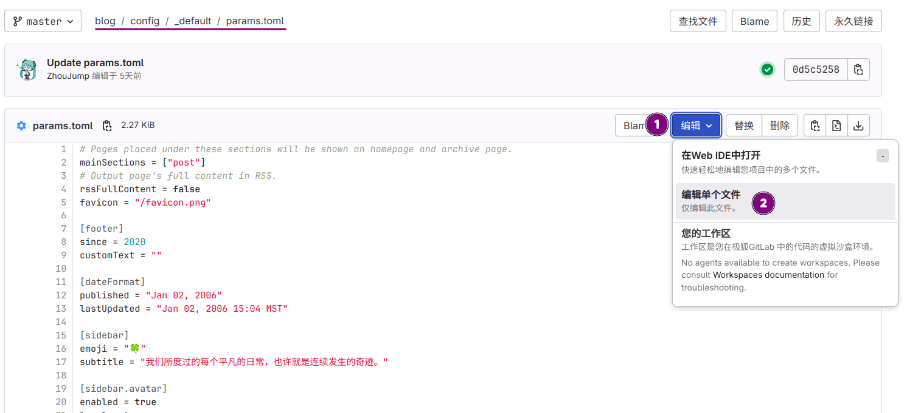

>前言：本文继续上文，讲一讲如何为你的博客添加评论系统。
>[阅读之前的文章](/tags/hugo/)

## 部署waline

这部分waline官网有详细介绍，我们只需要做到 **Vercel 部署 (服务端)** 这一步即可。有购买域名的小伙伴可以往下再做一步。完成部署后就能回到本文继续配置啦。
[点击前往waline教程](https://waline.js.org/guide/get-started/)
>vercel如果出现访问困难，请使用魔法上网。



## 部署hugo

>我们假设你完全按照教程配置了hugo，而且没有使用其它的hugo主题。

进入已经部署的vercel项目 选择**Settings>Domains**前往域名管理界面，复制一个域名备用。



前往gitlab，找到`config/_default/params.toml`文件，编辑从107行开始的代码



```go
[comments.waline]
serverURL = "domain.com"//此处填写你在上一步中复制的域名
lang = "zh-CN"
visitor = ""
avatar = ""
emoji = ["https://unpkg.com/@waline/emojis@1.1.0/weibo"]
meta = ['nick', 'mail']//填写你想让用户留下的信息
requiredMeta = ['nick']//填写用户必填信息，为空则允许匿名
placeholder = "留下你的评论吧！"
```
有关此处配置的详细信息可以[点击这里](https://waline.js.org/reference/client/props.html#meta)详细了解

编辑完，然后保存。等待流水线运行，之后你就能看见在文章末尾出现评论区了。

