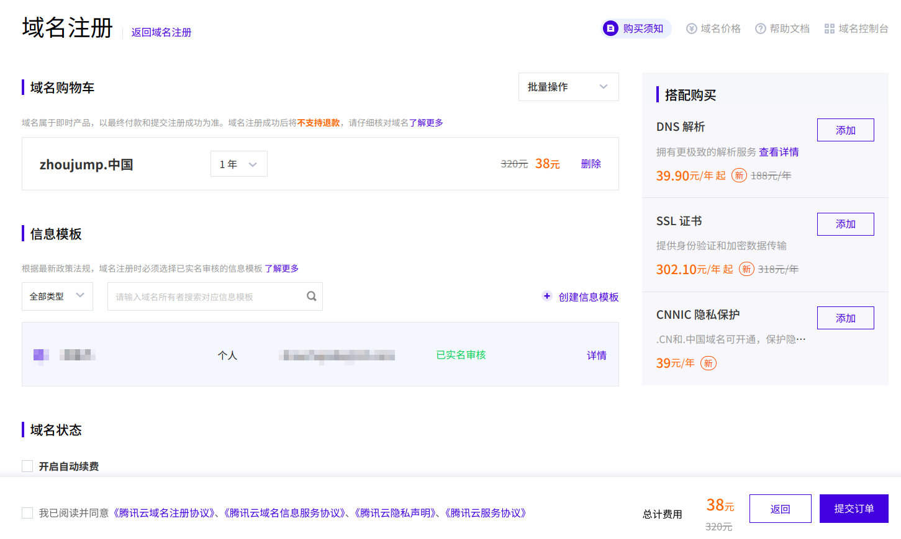
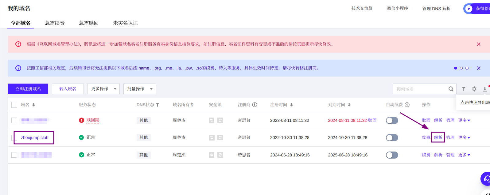

> Original article: [HUGO, domain name!](https://blog.zhoujump.club/en/p/hugo-domain/)

>Foreword: This article continues the previous article and talks about how to buy a domain name and then bind our web page to it.
>[Read previous articles](/tags/hugo/)

## Buy a domain name
### Check the domain name
Before buying a domain name, the first step should be to check whether the domain name you want to buy is still available. Just like you can't buy `baidu.com`, because this domain name currently belongs to Baidu, you can only buy those domain names that have not been registered (of course, there is nothing that money can't do).

There are many vendors that provide domain name registration. You can Baidu "domain name registration" and there will be many results. This article uses Tencent Cloud as an example to register a domain name. [Click me to jump to Tencent Cloud domain name registration](https://buy.cloud.tencent.com/domain).

The current domain name purchase process is very simple. Search for the domain name of interest and the system will give recommendations. By the way, the support for Chinese domain names is now relatively good.

We choose a domain name to add to the shopping cart and then purchase it. Of course, if you use Tencent Cloud for the first time, you need to go through the registration and real-name authentication process. Generally speaking, a more favorable price will be given for the first year of registration.

Then go to the [Domain name console](https://console.cloud.tencent.com/domain/all-domain/all) to see the domain name you purchased.

## Bind to pages

### Settings in gitlab

Return to Deployment>pages and click the **New Domain** button

Enter a subdomain of the domain you purchased, and then click **Create New Domain**
>I purchased `zhoujump.club`, which is called a root domain. For example, domains like `www.zhoujump.club` and `blog.zhoujump.club` are subdomains, and you can name them whatever you want. Of course, you can also use the root domain, but you may encounter trouble in the next step.

If you are adding it for the first time, the **Verification Status** here may be red, it doesn't matter, we will make it green immediately.

### Domain Settings

Let's put the page of the previous step aside for now, go to the domain console, find the domain you purchased, and select **Resolution**.

Then create two new resolution records and fill them in according to the information given on the previous page. And save.

At this time, we wait for a few minutes, because it takes a little time for the resolution to take effect, then go back to the previous page and click the **Refresh** button, you will find that the verification status turns green. At this time, we can **Save changes**

After completing these settings, we enter the subdomain name just bound into the browser address bar and press Enter. Your website can now be accessed using the domain name
