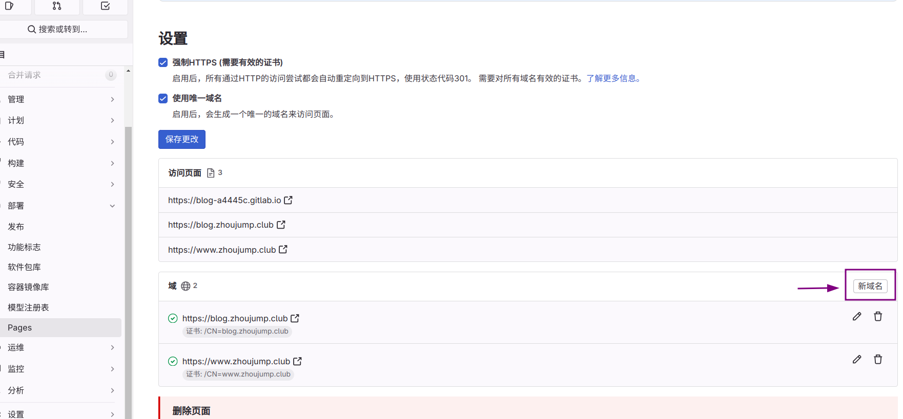

>前言：本文继续上文，讲一讲如何购买一个域名，然后将咱的网页绑定在其上。
>[阅读之前的文章](/tags/hugo/)

## 购买域名
### 查询域名
在购买域名之前，第一步应该是查询想购买的域名是否还在。就像你没法购买`baidu.com`，因为这个域名目前是归百度的，你只能购买那些没被注册的域名(当然没有什么是钞能力没法办到的)。

提供域名注册的厂商很多，你可以百度一下‘域名注册’，会有很多的结果。本文以腾讯云为例注册域名。[点击我跳转至腾讯云域名注册](https://buy.cloud.tencent.com/domain)。

现在的域名购买流程非常简单，搜索感兴趣的域名，系统会给出推荐。顺带一提，现在中文域名的支持也已经比较好了。

我们选择一个域名加入购物车，然后购买它，当然第一次使用腾讯云的话需要走一遍注册和实名认证的流程。一般来说注册第一年会给一个比较优惠的价格。

然后前往[域名控制台](https://console.cloud.tencent.com/domain/all-domain/all)就能看到你购买的域名了。

## 绑定至pages

### gitlab内设置

再次回到 部署>pages 点击**新域名**按钮

输入一个你所购买的域名的子域名,然后点击**创建新域名**
>我购买了`zhoujump.club`，它被称为一个根域名。例如`www.zhoujump.club`,`blog.zhoujump.club`这样的域名就是子域名，你可以随便取名。当然你也可以使用根域名，但是可能会在下一步遇到麻烦。

如果你是第一次添加,**验证状态**这里可能是红色的，没关系，我们马上让他变成绿色。

### 域名设置

上一步的页面我们先放到一边，前往域名控制台，找到你购买的域名，选择**解析**。

然后新建两条解析记录，按照之前那个页面给出的信息填写完整。并保存。

此时我们静待几分钟，因为解析生效需要一点时间，然后回到之前那个页面点击**刷新**按钮，你会发现验证状态变绿了。此时我们就能**保存更改**了

完成这些设置后，我们把刚刚绑定的子域名输入浏览器地址栏然后回车。你的网站已经可以使用域名访问了

