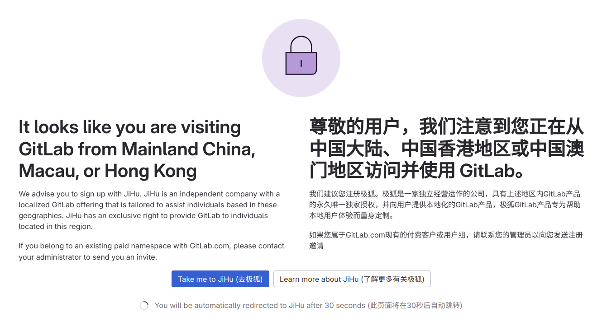
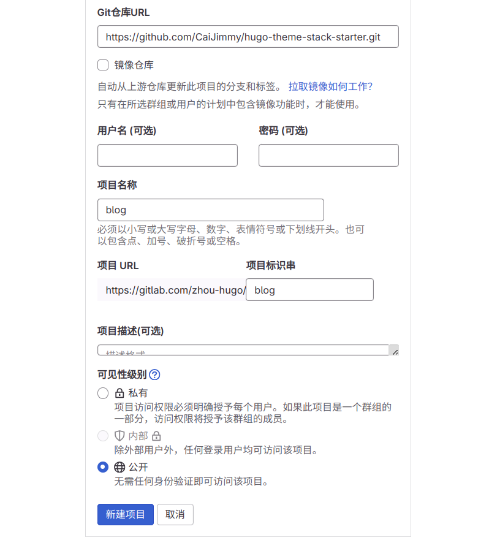
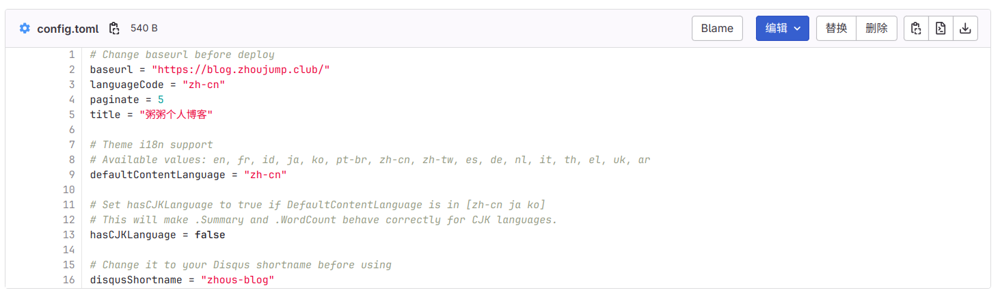

> Original article: [HUGO, start!](https://blog.zhoujump.club/en/p/hugo-start/)

>Foreword: This article will teach you how to start a hugo project at the speed of light, and host it for free on gitlab pages for everyone to access, just like the website you are seeing now.
## Prepare an account
At present, what you need to prepare is very simple, just a gitlab account, if you don't have one, you can [click here](https://gitlab.com/users/sign_up) to register one.
>If you encounter this situation, you may need magic Internet access. The mainland-only version of Jihu does not provide pages service
>
>

After registration, you will be asked to fill in some information. When you fill in this step, you can deploy.


## Pull and deploy
### Create a project
Please give the group name a name you like, and then click the **Warehouse (URL)** button below.

Next, scroll down and fill in `https://github.com/CaiJimmy/hugo-theme-stack-starter.git` in **Git Repository URL**

**Project Name** and **Project Identifier** are also names you like, and then **Visibility Level** selects 'Public',

Finally, click **New Project**



### Start Project
As shown in the figure, click **+** and then click **New File**, let's create a new configuration file to start the gitlab pipeline.


Fill in `.gitlab-ci.yml` in the file name.
Enter the following content in the text: 
```go
variables:
  DART_SASS_VERSION: 1.77.5
  HUGO_VERSION: 0.128.0
  NODE_VERSION: 20.x
  GIT_DEPTH: 0
  GIT_STRATEGY: clone
  GIT_SUBMODULE_STRATEGY: recursive
  TZ: America/Los_Angeles

image:
  name: golang:1.22.1-bookworm

pages:
  script:
    # Install brotli
    - apt-get update
    - apt-get install -y brotli
    # Install Dart Sass
    - curl -LJO https://github.com/sass/dart-sass/releases/download/${DART_SASS_VERSION}/dart-sass-${DART_SASS_VERSION}-linux-x64.tar.gz
    - tar -xf dart-sass-${DART_SASS_VERSION}-linux-x64.tar.gz
    - cp -r dart-sass/ /usr/local/bin
    - rm -rf dart-sass*
    - export PATH=/usr/local/bin/dart-sass:$PATH
    # Install Hugo
    - curl -LJO https://github.com/gohugoio/hugo/releases/download/v${HUGO_VERSION}/hugo_extended_${HUGO_VERSION}_linux-amd64.deb
    - apt-get install -y ./hugo_extended_${HUGO_VERSION}_linux-amd64.deb
    - rm hugo_extended_${HUGO_VERSION}_linux-amd64.deb
    # Install Node.js
    - curl -fsSL https://deb.nodesource.com/setup_${NODE_VERSION} | bash -
    - apt-get install -y nodejs
    # Install Node.js dependencies
    - "[[ -f package-lock.json || -f npm-shrinkwrap.json ]] && npm ci || true"
    # Build
    - hugo --gc --minify
    # Compress
    - find public -type f -regex '.*\.\(css\|html\|js\|txt\|xml\)$' -exec gzip -f -k {} \;
    - find public -type f -regex '.*\.\(css\|html\|js\|txt\|xml\)$' -exec brotli -f -k {} \;
  artifacts:
    paths:
      - public
  rules:
    - if: $CI_COMMIT_BRANCH == $CI_DEFAULT_BRANCH
```

Then scroll down and select **Submit changes**.


Next, we click **Build**, then click **Pipeline**, and you can see the project currently being built.
>If you have just registered a gitlab account, you may be asked to verify your phone number. You need to prepare a non-mainland phone number to receive text messages.


When the pipeline status changes to **Passed**, we click **Deploy**, then click **Pages**, and you can see the URL assigned by gitlab for us.


We click this link to open our website.


If the interface displays abnormally after opening, you need to go to the `config/_default/config.toml` file to modify some configurations and change the content in `baseurl` to the address assigned by gitlab in the previous step. After saving the file, wait for the pipeline to execute again, and then refresh the page, the website should be displayed normally.
>Because I have bound a domain name here, I filled in the domain name. In the next article, I will teach you how to purchase and bind a domain name.


