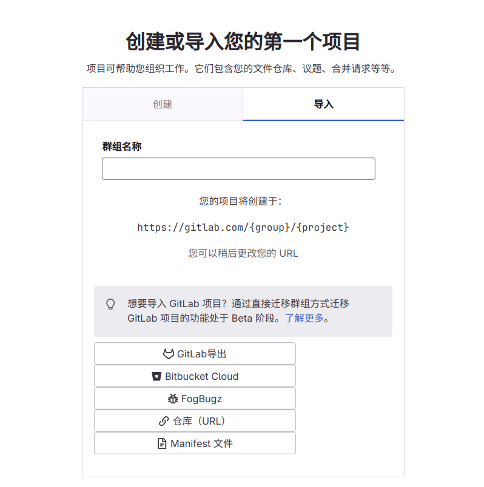
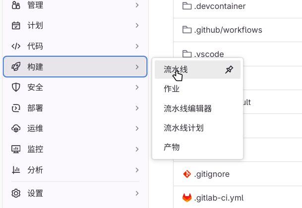
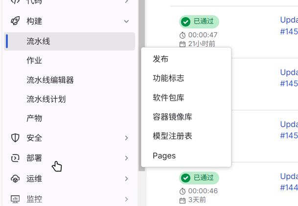

>前言：本文章将光速教会你如何启动一个hugo项目，并且将其免费托管至gitlab pages以供所有人访问，就像你现在看到的这个网站一样。
# 准备账号
目前你需要准备的非常简单，只需要一个gitlab账号，没有的话可以[点击这里](https://gitlab.com/users/sign_up)去注册一个。
>如果遇到这种情况，你可能需要魔法上网。大陆特供版极狐不提供pages服务


注册完成后会要求你填写一些信息，当你填写到这一步时就能进行部署了。


# 拉取部署
## 创建项目
群组名称请取一个你喜欢的名字，然后点击下边的**仓库(URL)** 按钮。

接下来往下翻，在**Git仓库URL**中填写`https://github.com/CaiJimmy/hugo-theme-stack-starter.git`

**项目名称**和**项目标识串**也是取一个你喜欢的名字，然后**可见性级别**选择‘公开’，

最后点击**新建项目**


## 启动项目
如图，点击 **+** 再点击**新建文件**，让我们来新建一个配置文件以启动gitlab流水线。


文件名处填写`.gitlab-ci.yml`。
正文输入以下内容：
```go
variables:
  DART_SASS_VERSION: 1.77.5
  HUGO_VERSION: 0.128.0
  NODE_VERSION: 20.x
  GIT_DEPTH: 0
  GIT_STRATEGY: clone
  GIT_SUBMODULE_STRATEGY: recursive
  TZ: America/Los_Angeles

image:
  name: golang:1.22.1-bookworm

pages:
  script:
    # Install brotli
    - apt-get update
    - apt-get install -y brotli
    # Install Dart Sass
    - curl -LJO https://github.com/sass/dart-sass/releases/download/${DART_SASS_VERSION}/dart-sass-${DART_SASS_VERSION}-linux-x64.tar.gz
    - tar -xf dart-sass-${DART_SASS_VERSION}-linux-x64.tar.gz
    - cp -r dart-sass/ /usr/local/bin
    - rm -rf dart-sass*
    - export PATH=/usr/local/bin/dart-sass:$PATH
    # Install Hugo
    - curl -LJO https://github.com/gohugoio/hugo/releases/download/v${HUGO_VERSION}/hugo_extended_${HUGO_VERSION}_linux-amd64.deb
    - apt-get install -y ./hugo_extended_${HUGO_VERSION}_linux-amd64.deb
    - rm hugo_extended_${HUGO_VERSION}_linux-amd64.deb
    # Install Node.js
    - curl -fsSL https://deb.nodesource.com/setup_${NODE_VERSION} | bash -
    - apt-get install -y nodejs
    # Install Node.js dependencies
    - "[[ -f package-lock.json || -f npm-shrinkwrap.json ]] && npm ci || true"
    # Build
    - hugo --gc --minify
    # Compress
    - find public -type f -regex '.*\.\(css\|html\|js\|txt\|xml\)$' -exec gzip -f -k {} \;
    - find public -type f -regex '.*\.\(css\|html\|js\|txt\|xml\)$' -exec brotli -f -k {} \;
  artifacts:
    paths:
      - public
  rules:
    - if: $CI_COMMIT_BRANCH == $CI_DEFAULT_BRANCH
```

然后往下翻，选择**提交更改**。


接下来我们点击**构建**，再点击**流水线**，就能看到目前正在构建项目。
>如果你是现在才注册的gitlab账号，可能会要求你验证电话号码，你需要准备一个非大陆的电话号码用于接收短信。



当流水线状态变为**已通过**后，我们点击**部署**，再点击**Pages**，就能看到gitlab为我们分配的网址了。


我们点击这个链接，就能打开咱的网站了。


如果打开后界面显示异常，需要前往`config/_default/config.toml`文件修改部分配置，将`baseurl`中的内容改为上一步中gitlab分配的地址。保存文件后再次等待流水线执行，然后刷新页面，网站应该就可以正常显示了。
>此处因为我绑定了域名，所以填写了域名，下一篇文章我将教你如何购买和绑定域名。

