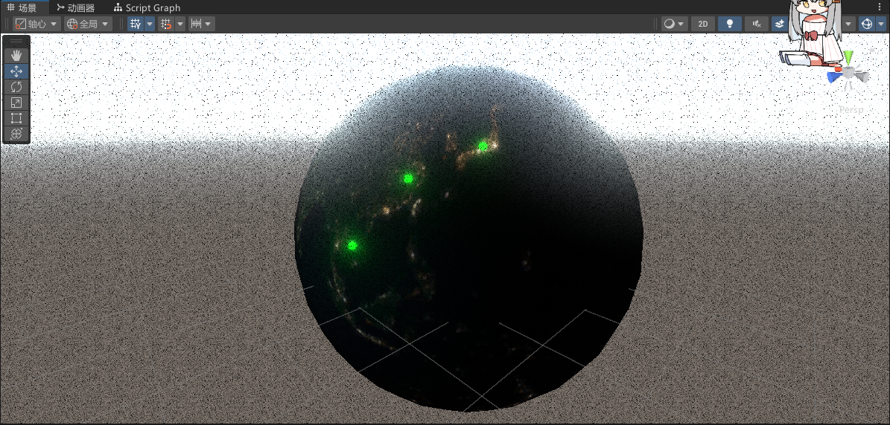
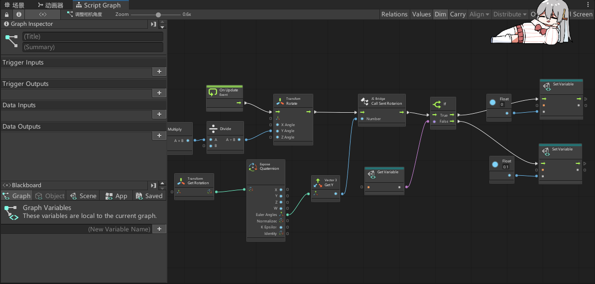
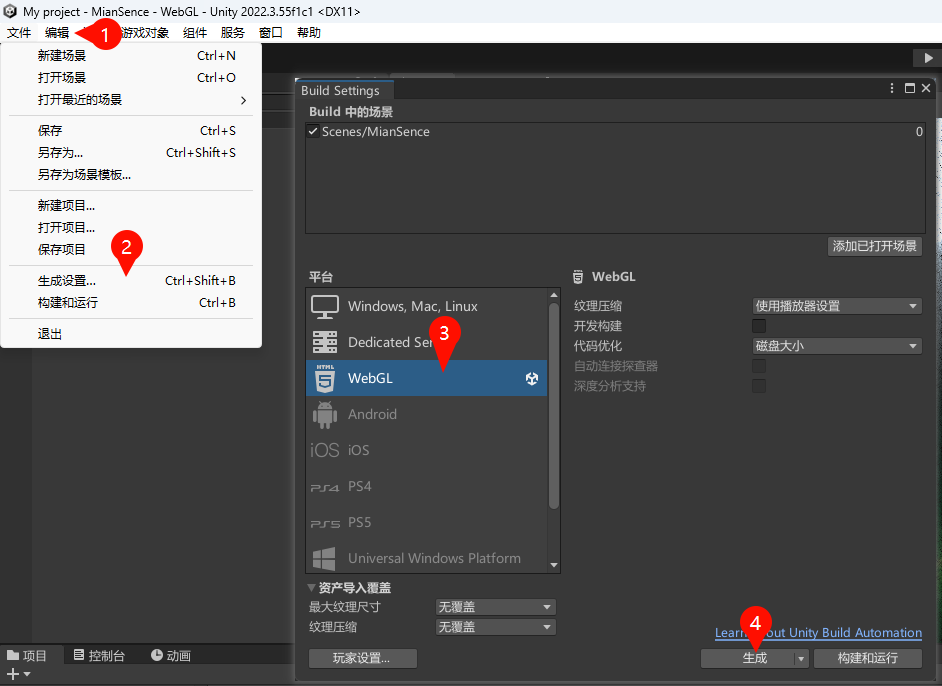
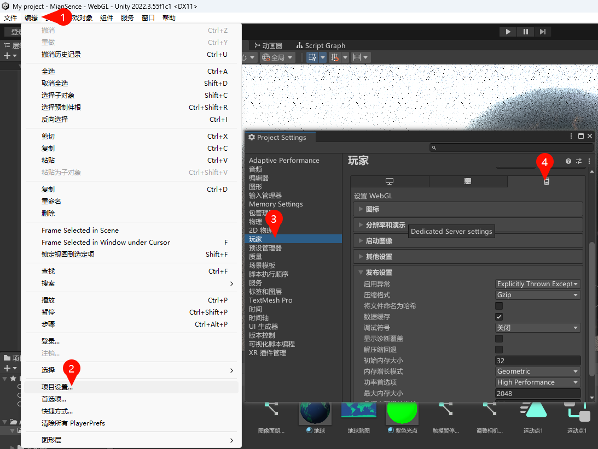
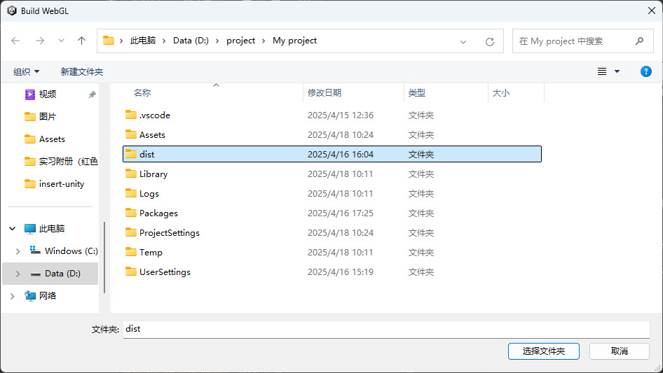
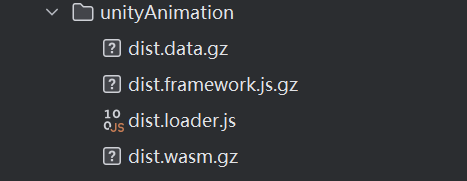

> Original article: [How to embed UnityWeb3D into a page](https://blog.zhoujump.club/en/p/insert-unity/)

With the improvement of equipment performance now, it is no longer a rare thing to insert 3D models into the website. Moreover, inserting 3D elements can greatly improve the user experience, and some user interactions can give people a very amazing experience.

Currently, the most popular Web3D technologies include three.js, visual editing models and interactive splines, but the difficulty of learning three.js and the high price of spline are enough to discourage some people.
So are there more economical and simpler technologies? Some are some, some are some, and UnityWeb3D may be a good choice.
## Project preparation
Unity's scene construction and post-processing are very simple, without writing code and shaders. Specific operation methods: There are so many tutorials to learn at B station University. I have prepared an earth here and added some filters to it.

Interaction is also very simple, just write some interactive logic through visual scripts. You can also go to Bilibili University for an elective.

After you have prepared the project, select it in turn`Edit`>`Build Settings`>`WebGL`>`Switch Platform`, switch the project to the WebGL platform, and the progress bar will be passed once during the unity. I've switched here, so the Generate button is displayed.

After waiting for the switch to complete, you can make some configurations of the generation settings and select`Edit`>`Project Settings`>`Player`>`H5`. Choose configuration according to your needs. Unit uses gzip compression by default, which can greatly reduce the generation size, but we need to configure gzip on the server. Fu Ge, who thinks it’s troublesome and does not lack traffic bandwidth, can turn it off.
  
Then click Generate, unity will let you select a folder to save the generated files. I have created a new dist folder here to place the generated files. After waiting for unity generation to complete, an index.html and a Build folder will be generated.

## Embed UnityWeb3D
Let's upload all the files in the Build folder to the server. There are four files in total. I've put them here.`assets/unityAnimation`Under the folder.
   
Then, the page will be introduced first.`dist.loader.js`The file is then prepared and an id is given to us so that we can get it in js.
```html
<script src="/assets/unityAnimation/dist.loader.js"></script>
<canvas id="unity-canvas"></canvas>
```
Then use`createUnityInstance()`Function to create UnityWeb3D instances. In the configuration, these paths can be used by changing them to the file paths you upload. Other configurations are in the official documentation:[WebGL templates](https://docs.unity3d.com/2021.3/Documentation/Manual/webgl-templates.html)You can view it here.
Because I enable gzip compression, I need to add the .gz suffix here. If you do not enable gzip in the generation settings, you do not need to add a suffix. After refreshing the page, you will find that the model is loading correctly. If gzip is enabled, gzip needs to be configured on the server.
```js
createUnityInstance(document.querySelector("#unity-canvas"), {
dataUrl: "/assets/unityAnimation/dist.data.gz",
frameworkUrl: "/assets/unityAnimation/dist.framework.js.gz",
codeUrl: "/assets/unityAnimation/dist.wasm.gz",
});
```
My server is using Nginx, so I need to add the following code to the Nginx configuration file to enable gzip. The advantage of using gzip is to reduce the resource size. I have a total of 30M before the compression of this earth, and only 8M after compression. It is very amazing.
Of course, if you choose other compression methods or servers, in the official document:[WebGL: server configuration code sample](https://docs.unity3d.com/2021.1/Documentation/Manual/webgl-server-configuration-code-samples.html)There are also detailed instructions.
```nginx
location ~ .+\.(data|symbols\.json)\.gz$ {
gzip on;
add_header Content-Encoding gzip;
default_type application/octet-stream;
}
location ~ .+\.js\.gz$ {
gzip on;
add_header Content-Encoding gzip;
default_type application/javascript;
}
location ~ .+\.wasm\.gz$ {
gzip on;
add_header Content-Encoding gzip;
default_type application/wasm;
   }
```
## See the effect
In this way, I, a front-end person who doesn't understand Unity3D and C# at all, can also achieve such a super cool effect.
