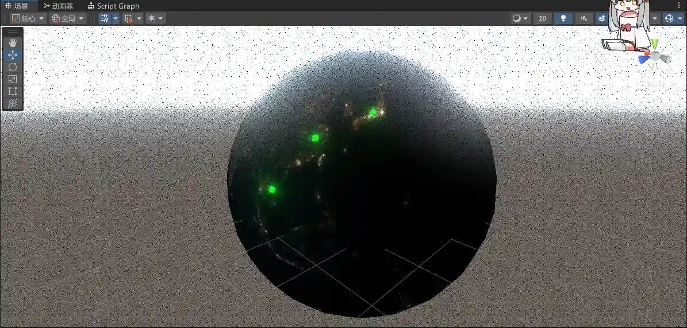
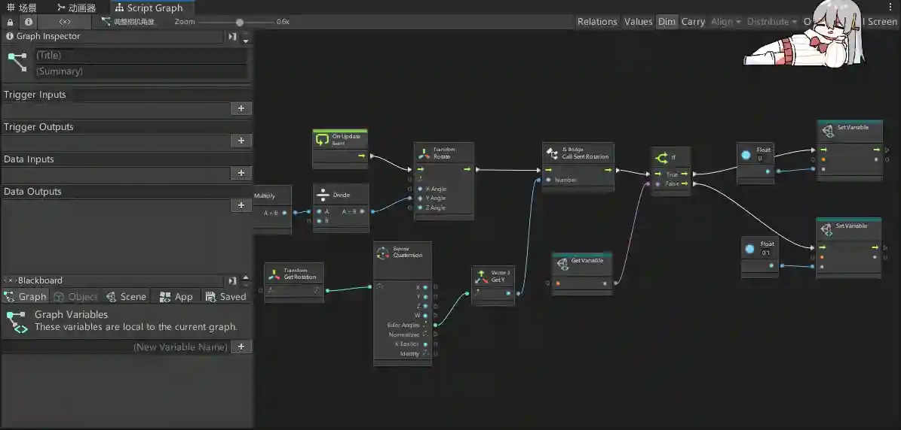
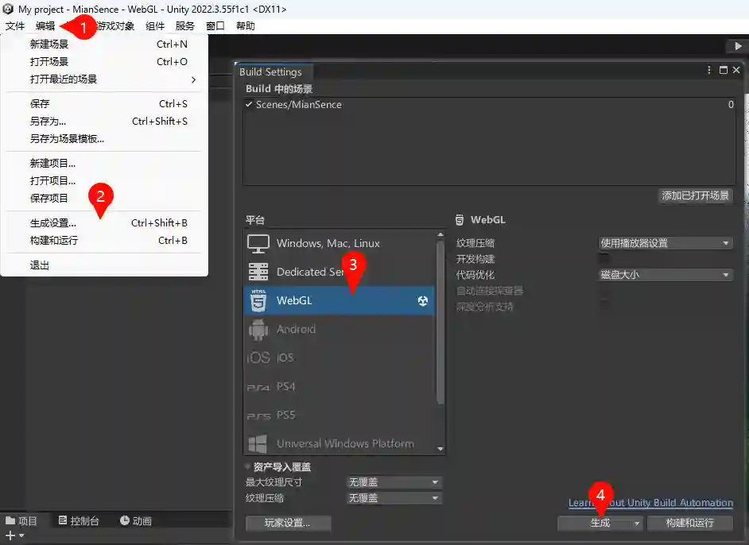
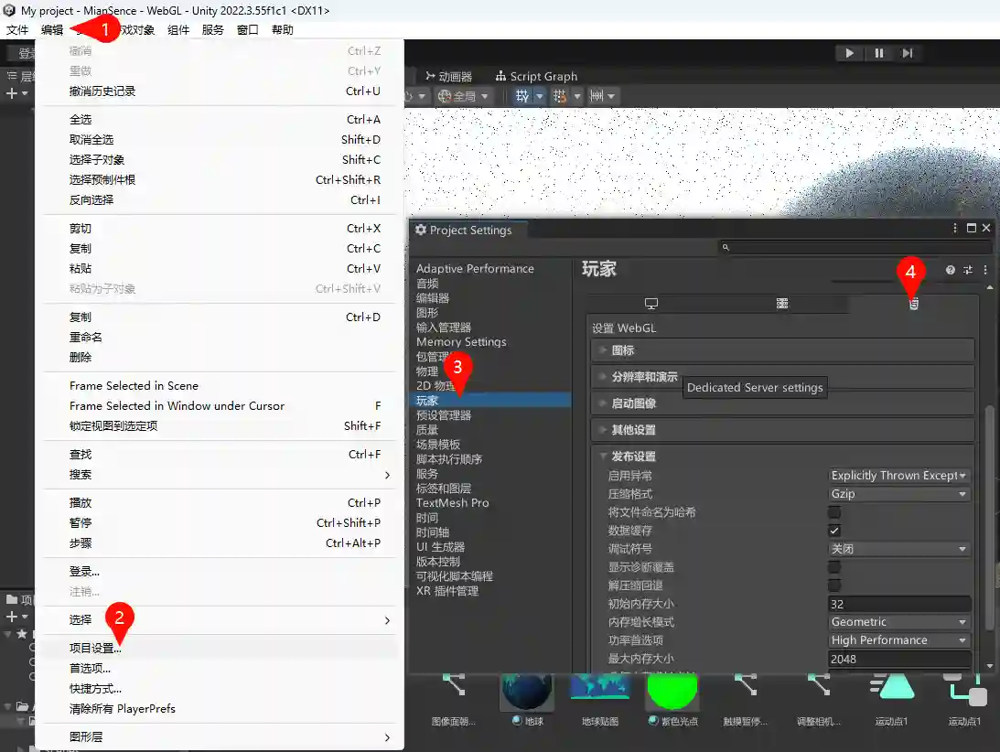
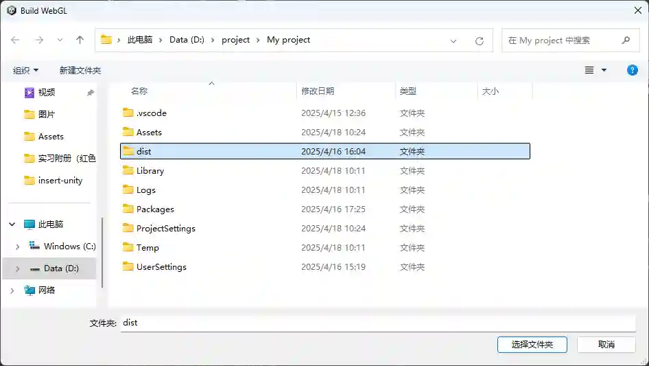
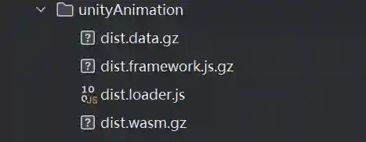

> 文章在个人网站中发布，原文链接：[如何向页面中嵌入UnityWeb3D](https://blog.zhoujump.club/p/insert-unity/)

随着现在设备性能的提升，向网站中插入3D模型已经不是啥稀奇事情了。而且插入3D元素能极高地提高用户体验，再加上一些用户交互就能给人非常惊艳的体验。  

目前比较流行的Web3D技术有three.js、还有可视化编辑模型与交互的spline，不过three.js的学习难度和spline的高昂价格已经足够让一部分人望而却步了。  
那有没有更经济和简单的技术呢？有的有的，兄弟有的，UnityWeb3D也许就是一个不错的选择。
## 工程准备
Unity的场景搭建和后处理的添加非常简单，无需书写代码和着色器。具体操作方式B站大学有超级多教程可以学习，我这里准备了一个地球然后给它加了一些滤镜。

交互也是非常简单，通过可视化脚本写一些交互逻辑就可以了。具体也可以去B站大学选修。  

准备好工程后依次选择`编辑`>`生成设置`>`WebGL`>`切换平台`，切换项目至WebGL平台，期间unity会走一次进度条。我这里已经切换过了，所以显示的是生成按钮。  

等待切换完成后可以对生成设置进行一些配置，选择`编辑`>`项目设置`>`玩家`>`H5`。根据自己的需求来选择配置。unity默认使用了gzip压缩，可以大幅度降低生成大小，只是我们需要在服务器上配置gzip。嫌麻烦而且不缺流量带宽的富哥可以关掉。
  
然后点击生成，unity会让你选择一个文件夹来保存生成的文件。我这里新建了一个dist文件夹用来放置生成的文件。等待unity生成完成后，会生成一个index.html和一个Build文件夹。

## 嵌入UnityWeb3D
咱们把Build文件夹中所有文件都上传至服务器上，总共是四个文件，这里我是放在了`assets/unityAnimation`文件夹下。 
   
然后页面这边先引入刚刚上传的`dist.loader.js`文件，然后再准备一个canvas元素，并给予一个id，方便咱们在js中获取到它。
```html
<script src="/assets/unityAnimation/dist.loader.js"></script>
<canvas id="unity-canvas"></canvas>
```
然后使用`createUnityInstance()`函数来创建UnityWeb3D实例。配置中这些路径都换成自己上传的文件路径就可以使用了，其它的配置在官方文档：[WebGL templates](https://docs.unity3d.com/cn/2021.3/Manual/webgl-templates.html#build_configuration)处可以查看。  
因为我开启了gzip压缩，所以这里需要加上.gz后缀。如果你没有在生成设置开启gzip就不需要加后缀而且做完这步刷新页面就会发现模型正确加载了。如果开启了gzip则服务器上还需要再配置一下gzip。
```js
createUnityInstance(document.querySelector("#unity-canvas"), {
    dataUrl: "/assets/unityAnimation/dist.data.gz",
    frameworkUrl: "/assets/unityAnimation/dist.framework.js.gz",
    codeUrl: "/assets/unityAnimation/dist.wasm.gz",
});
```
我的服务端是使用的Nginx，所以需要在Nginx的配置文件中添加如下代码来开启gzip。使用gzip的好处是减小资源大小，我这个地球压缩前有足足30M，压缩之后只有8M了，可谓是非常amazing啊。  
当然如果你选择了其它的压缩方式或者服务端，在官方文档：[WebGL：服务器配置代码示例](https://docs.unity3d.com/cn/2021.1/Manual/webgl-server-configuration-code-samples.html)也有详细的说明。
```nginx
location ~ .+\.(data|symbols\.json)\.gz$ {
    gzip on;
    add_header Content-Encoding gzip;
    default_type application/octet-stream;
}
location ~ .+\.js\.gz$ {
    gzip on;
    add_header Content-Encoding gzip;
    default_type application/javascript;
}
location ~ .+\.wasm\.gz$ {
    gzip on;
    add_header Content-Encoding gzip;
    default_type application/wasm;
   }
```
## 看看效果
就这样，我一个完全不懂Unity3D和C#的前端人也能做出这样超级炫酷的效果啦。

