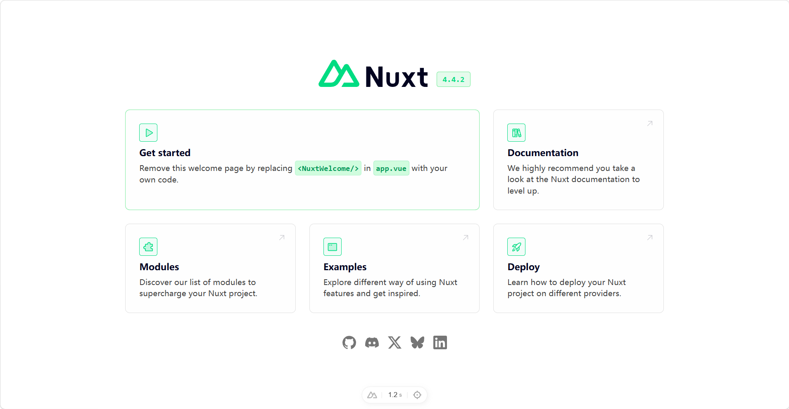
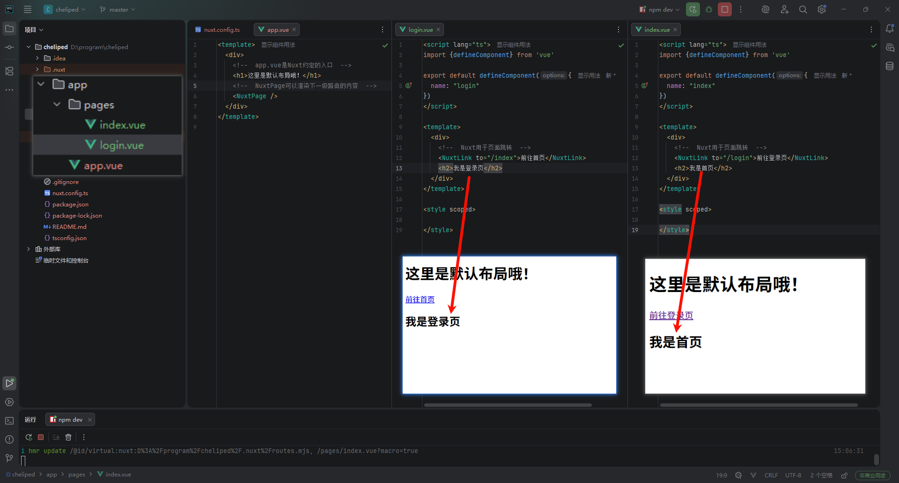
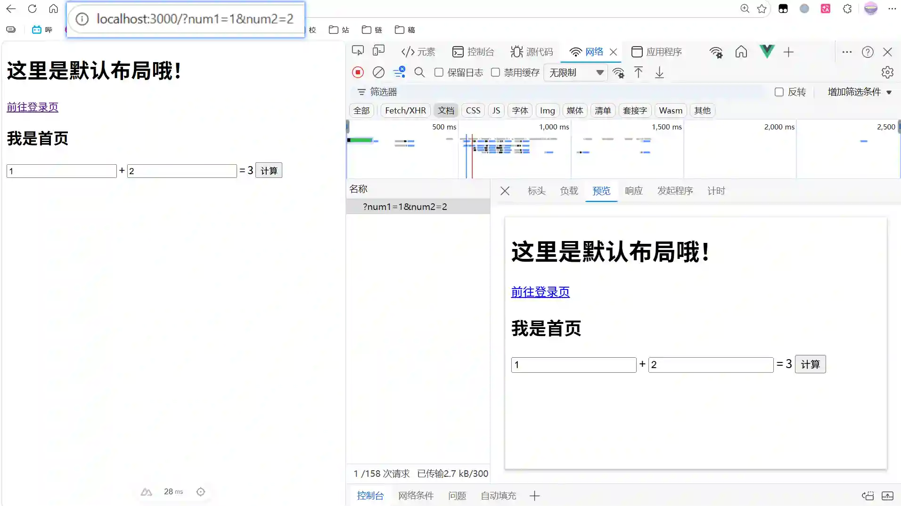
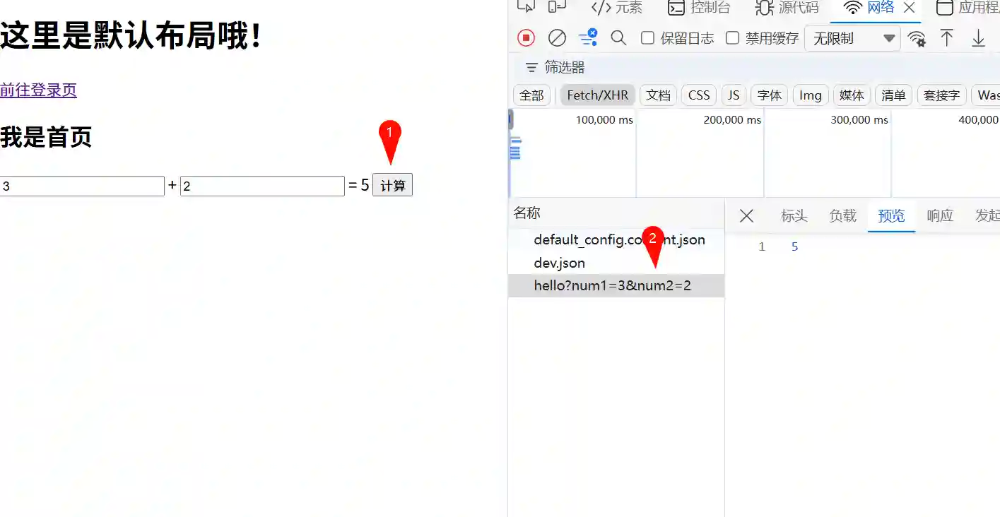

> This article is published on my personal website. Original link: [Nuxt Learning Journey 1](https://blog.zhoujump.club/p/learn-nuxt-1/)

## Introduction

In the era of AI, being a simple "UI slicer" or having only basic knowledge of frontend engineering is no longer a high-value skill. To avoid being left behind by the rapidly advancing wheels of technology, I’ve decided to learn full-stack development while I'm still young. Since there are relatively few comprehensive Nuxt tutorials in Chinese, I've started this series to document my learning and help others avoid common pitfalls.

## Installing Nuxt

I am using WebStorm to create the project directly. For beginners, convenience and avoiding initial setup errors should be the top priorities. Of course, creating a project with other IDEs is also simple. The following command creates a project using the latest version of Nuxt:

```bash
npm create nuxt@latest your-project-name
```
The subsequent process is the same regardless of the IDE. Nuxt will start an interactive configuration flow. Once completed, you can start the development server with `npm run dev`.

```bash
npm run dev
```

And just like that, our first Nuxt project is up and running!



## Convention Over Configuration

A key feature of Nuxt is **Convention Over Configuration**. In theory, we don't need to write any configuration files; Nuxt works according to predefined conventions. For example, we don't need to configure routes manually. By simply creating files in the `pages` directory, Nuxt automatically recognizes them and creates the corresponding routes.

Let's try adding a login page:

### Creating Pages

First, we create a `pages` directory inside the `app` directory. Create `app/pages/index.vue` and `app/pages/login.vue`, then add the relevant content. At this point, if we delete `app.vue`, Nuxt will automatically render `index.vue` as the homepage.

```vue
<script lang="ts">
import {defineComponent} from 'vue'

export default defineComponent({
  name: "index"
})
</script>

<template>
  <div>
    <NuxtLink to="/login">Go to Login Page</NuxtLink>
    <h2>This is the Homepage</h2>
  </div>
</template>

<style scoped>

</style>
```

### Default Layout

So, what is `app.vue`? It is our default layout file, effectively the parent component for all pages. While deleting it lets Nuxt render `index.vue` by convention, let’s keep it and write some layout code:

```vue
<template>
  <div>
    <h1>This is the Default Layout!</h1>
    <NuxtPage />
  </div>
</template>
```
If Nuxt finds `app.vue`, it will use it to wrap and render `index.vue` as the homepage. Our page and project structure now look like this:



### Creating a Web API

Nuxt’s network interfaces are also convention-based and written in JavaScript, which is very friendly for frontend developers. Create a `server` directory in the project root (note: not inside the `app` directory), then create a `server/api/hello.ts` file. Nuxt will automatically create the `/api/hello` endpoint.

Let's write a simple API to calculate the sum of two numbers:

```ts
export default defineEventHandler((event) => {
    // Get query parameters num1 and num2
    const query = getQuery(event)
    const num1 = Number(query.num1)
    const num2 = Number(query.num2)
    
    if(isNaN(num1) || isNaN(num2)) {
        // If parameters are not numbers, throw an error
        throw createError({
            status: 500,
            statusText: "Invalid query number",
        })
    } else {
        // Return the calculation result
        return num1 + num2
    }
})
```

### Using the API in the Frontend

Let’s try calling this API in `app/pages/index.vue`. This code might look confusing at first glance, but I will explain it in parts below.

```vue
<script lang="ts">
import {defineComponent} from 'vue'

export default defineComponent({
  name: "index",
  data(): any {
    // This data, once processed by the server, will be sent to the frontend with the page
    return {
      result: 0,
      num1: 0,
      num2: 0,
    }
  },
  created(): any {
    // This part of the code executes on the server
    const route = useRoute()
    if(route.query.num1){ this.num1 = route.query.num1 }
    if(route.query.num2){ this.num2 = route.query.num2 }
    
    const data = useFetch('/api/hello',{
      query: { num1: this.num1, num2: this.num2 }
    })
    this.result = data.data
  },
  methods: {
    // This code executes in the browser
    async plus(){
      this.result = await $fetch('/api/hello',{
        query: { num1: this.num1, num2: this.num2 }
      })
    }
  }
})
</script>

<template>
  <div>
    <NuxtLink to="/login">Go to Login Page</NuxtLink>
    <h2>This is the Homepage</h2>
    <input v-model="num1"/> + <input v-model="num2"/> = {{result}}
    <button @click="plus">Calculate</button>
  </div>
</template>

<style scoped>

</style>
```

Let's look at the server-side logic first:

```js
    // This part of the code executes on the server
    // useRoute() accesses route parameters
    const route = useRoute()
    if(route.query.num1){ this.num1 = route.query.num1 }
    if(route.query.num2){ this.num2 = route.query.num2 }
    
    // useFetch() is used to call APIs internally on the server
    const data = useFetch('/api/hello',{
      query: { num1: this.num1, num2: this.num2 }
    })
    
    // Assigning to data; Nuxt will render this into the page
    this.result = data.data
```

In Nuxt, the `beforeCreate` and `created` lifecycles are run on the server. We can pre-assemble the page on the server, much like PHP.



As you can see, when we visit the page with parameters, the server returns the page with the result already calculated, unlike a traditional SPA that fetches an empty page and then fills in the data.

Now, let's look at the browser-side code:

```js
methods: {
    // This code executes in the browser
    async plus(){
      // $fetch() is the data request function provided by Nuxt
      this.result = await $fetch('/api/hello',{
        query: { num1: this.num1, num2: this.num2 }
      })
    }
  }
```

This is no different from an SPA. Binding this method to a button triggers a network request directly from the browser.



## Summary
Today, we set up and experienced Nuxt for the first time. We created two pages and one API, using them on both the frontend and backend. We've caught a glimpse of Nuxt's powerful server-side rendering capabilities and its seamless connection between the frontend and backend.